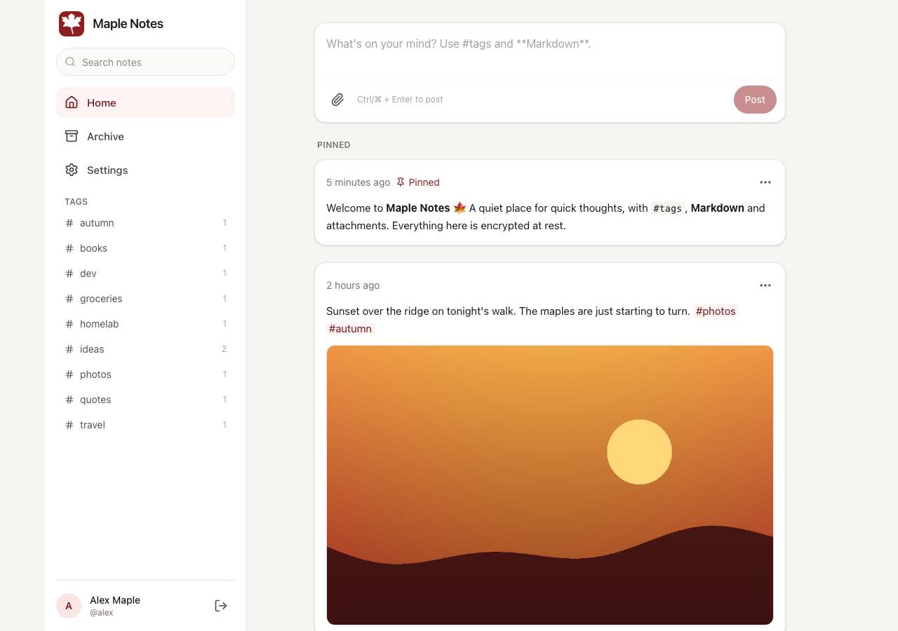
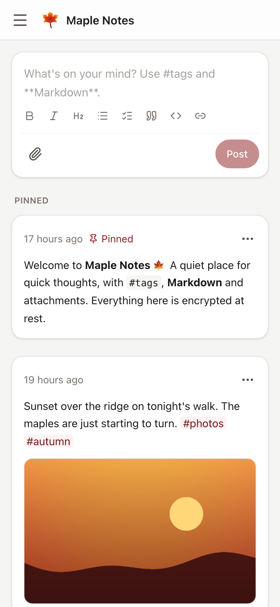
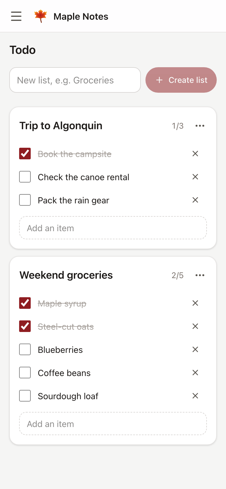
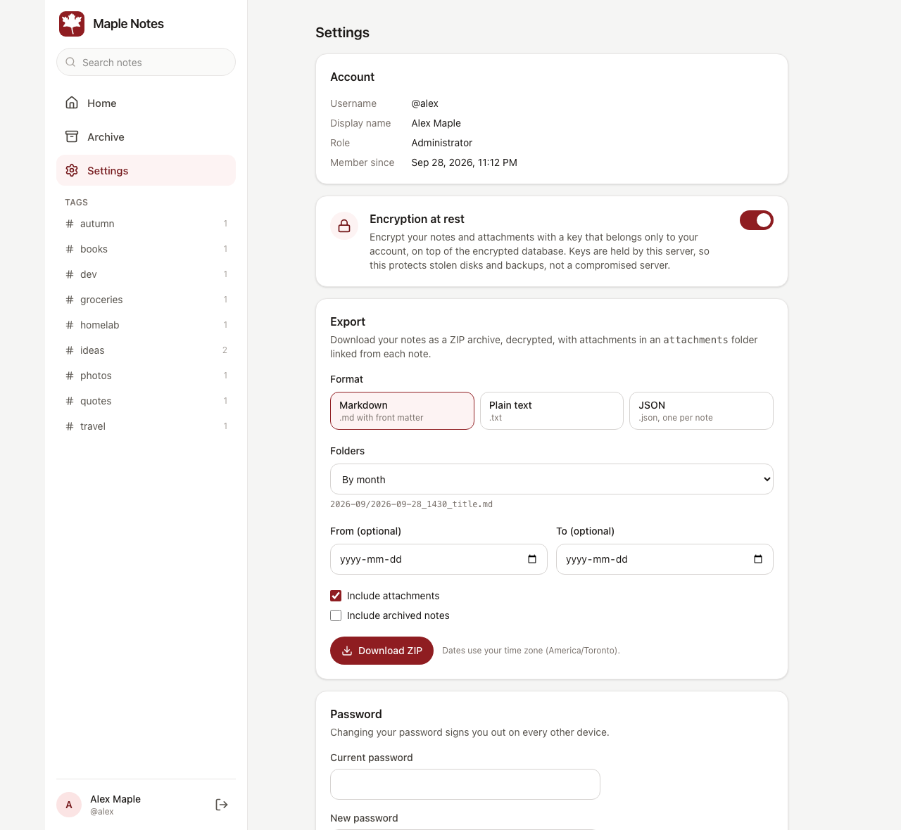
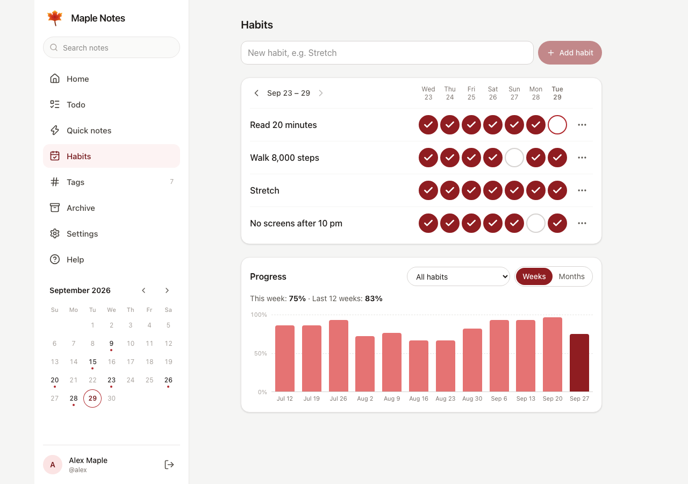

<p align="center">
  
</p>

<h1 align="center">Maple Notes</h1>

<p align="center">
  A self-hosted place for quick notes, encrypted at rest or end to end.<br>
  Timeline feed · todo lists · daily notes · habit tracker · Markdown and #tags · attachments · export and restore · one Docker container.
</p>

<p align="center">
  <a href="https://github.com/supunsarachitha/MapleNotes/actions/workflows/ci.yml"></a>
  
  
</p>

<p align="center">
  <a href="https://supunsarachitha.github.io/MapleNotes/"><b>Website</b></a> ·
  <a href="https://maplenotes.onrender.com/"><b>Live demo</b></a> ·
  <a href="https://buymeacoffee.com/jkhy9gtjs"><b>Buy me a coffee</b></a>
</p>



## Features

- **Timeline feed.** Newest notes first, a quick-post box at the top, pinned notes above the feed, and infinite
  scroll that stays stable while new notes arrive. Pictures, players and link previews load as they come into view,
  so a long timeline with thousands of notes and files opens as quickly as a short one.
- **Full note lifecycle.** Create, edit inline (optionally with a double-tap, always with the cursor at the end), pin,
  label, archive (and restore), and delete into a trash that keeps notes for 30 days, with Undo; or, with the trash
  off, delete for good after confirming.
- **Titles and dates.** Optionally give notes, and quick notes too, a title, which can start with today's date in the
  format you choose.
- **Todo lists.** A Todo tab for checklists: add items, tick them off, edit them all at once as Markdown, rename, pin
  and archive lists.
- **Quick notes.** A scratchpad tab for short notes that stay out of your timeline; move one to Home when it is worth
  keeping.
- **Daily notes.** Optionally, today's note at the top of Home, titled with the date and saved when you first write.
  Optionally, a note of yours serves as the template each new day's note starts with.
- **Habit tracker.** Optionally, a Habits tab: tick off the days you keep each habit, and follow your progress in a
  chart of weeks or months, with streaks, and in a month calendar.
- **Link previews.** Optionally, the title and description of links in your notes. Off by default: the server fetches
  the pages, so it sees the links.
- **Calendar.** A month calendar in the side menu marks the days you wrote on; choose a day to see its notes.
- **Your choice of features.** Each account turns titles, todo lists, quick notes, daily notes, the calendar, the
  habit tracker, the archive, the Tags page, labels, the trash and Help in the side menu on or off in Settings, on
  every device at once.
  Turning a feature off hides it and deletes nothing. Settings is organised in sections (Account, Appearance, Side
  menu, Writing, Features, Labels, Backup & data, Privacy & security), each with its own address.
- **Markdown and tags.** GitHub-flavoured Markdown (task lists you tick in place, tables, code), with a formatting toolbar and shortcuts
  in the editor, and clickable `#tags`, including
  nested tags such as `#work/meetings`. A Tags page lists them all, nested, with counts, a filter and two orders.
  Optionally, your existing tags are suggested while you type one.
- **Labels.** Optionally, coloured labels you put on notes and todo lists by hand, in ten colours, listed in the side
  menu with their notes. With end-to-end encryption their names are encrypted too.
- **Attachments.** Images, video, audio and any other file, added by file picker, paste or drag-and-drop, with
  upload progress. Images keep their shape on any screen and open in a full-screen viewer; audio and video play
  inline, and video seeking works on iOS. Optionally, photos are shrunk in the browser before they upload (at most
  2560 pixels, as JPEG), often to a tenth of the size.
- **Search.** Finds text in your notes, including encrypted ones. With end-to-end encryption, search runs in your
  browser.
- **Encryption, chosen per account.**
  - The database is always encrypted.
  - **Encrypted at rest** (the default): each account's notes and files are also encrypted with its own key, which
    the server holds.
  - **End-to-end**: your browser encrypts notes, tags, label names, file names and files with a key only you hold. The server
    stores ciphertext it cannot read, and a recovery key lets you reset a forgotten password.
  - Changing mode converts existing notes and files safely, resuming if it is interrupted.
- **Export and restore.** Download everything, decrypted, as a ZIP of Markdown, plain text or JSON files, in flat or
  year/month/day folders, with attachments linked by relative path. Restore such an export into any account, even on
  another server: notes keep their dates, pins, archive state, kind, labels and files, and notes you already have are
  skipped.
  Single Markdown, text and JSON files can be added too. With end-to-end encryption, your browser does both. To
  start over, an account can delete all of its notes and files at once and keep its sign-in and settings.
- **Storage at a glance.** Settings shows how much your notes and files take; administrators see the server's totals
  and free disk space, never another person's usage, and can compact the database to give the space deleted notes
  leave behind back to the disk.
- **Storage limit.** Optionally, administrators set how much each account can store, notes and files together. Each
  account sees its own usage against it; anything that would pass it is refused, and nothing already stored is lost.
- **Help built in.** A user guide in the app explains every feature, and works offline.
- **Accounts.** Multiple users with secure authentication, each with a display name of their choice, and optional
  two-factor sign-in with an authenticator app and single-use recovery codes. The first
  account becomes the administrator, who can give the app its own name and icon, open registration, limit each
  account's storage, choose how long devices stay signed in (30 to 400 days), disable or remove accounts, turn off
  two-factor sign-in for someone who lost their phone, and appoint other administrators. Administrators never see anyone's
  notes.
- **Mobile first.** Responsive design, keyboard shortcuts, and accessible menus and dialogs.
- **Install it as an app.** Add Maple Notes to your phone's home screen, or install it on your computer, and it opens
  in its own window, with the app's name and icon (or the ones an administrator chose).
- **Read and write offline.** On a device where you stay signed in, the app opens without a connection and shows the
  notes you read recently, still encrypted on the device for end-to-end accounts. New notes and edits made offline are
  kept on the device and saved when the server can be reached again; an edit never overwrites a newer one made
  elsewhere, it is saved as a separate note instead. Signing out deletes them.
- **Appearance.** Light or dark (or follow your device), seven accent colours, the side menu's order (drag or arrows)
  and text size, and the first day of the week, chosen in Settings and applied on every device.
- **Small and hardened.** One container: non-root, read-only root filesystem, built-in health check.

| Mobile | Todo lists | Settings |
|---|---|---|
|  |  |  |

| Habit tracker |
|---|
|  |

Dark mode: [screenshot](docs/screenshots/home-feed-dark.png).

## Quick start

You need Docker. Maple Notes listens on port 8080 inside the container. Open it at `http://localhost` on the server
itself; from any other device it needs HTTPS, because browsers only allow its in-page encryption on HTTPS or
`localhost` (see [Reverse proxy](#reverse-proxy-and-https)).

### The master key

Before its first start, Maple Notes needs one secret: the master key. It encrypts the database, the account keys the
server holds and the keys that sign sessions. It is 32 random bytes written as base64 (44 characters, ending in `=`),
and Maple Notes refuses to start with anything else. Either command prints a new one:

```sh
# Anywhere Docker runs, Windows included
docker run --rm ghcr.io/supunsarachitha/maplenotes:latest generate-key

# Linux or macOS
openssl rand -base64 32
```

Give it to Maple Notes as `MAPLE_MASTER_KEY`: in `.env` with Docker Compose, or with `-e` for `docker run`. To keep it
out of the environment, put it in a file and set `MAPLE_MASTER_KEY_FILE` to that file's path instead (a Docker
secret, for example). The [Portainer stacks](#portainer) do that for you: they create the key on first start, in a
volume of its own.

> [!IMPORTANT]
> **Create the key once and never change it:** a different key cannot open the data that already exists.
> **Keep a copy somewhere safe, such as a password manager, apart from your backups.** Without the key, your data
> cannot be recovered, by you or by anyone else.

### Docker Compose (recommended)

```sh
git clone https://github.com/supunsarachitha/MapleNotes.git
cd MapleNotes
cp .env.example .env

# Create the master key (see above) and put it in .env after MAPLE_MASTER_KEY=
openssl rand -base64 32

docker compose up -d --build
```

Open <http://localhost:8080> and create the first account. It becomes the administrator.

The repository's `docker-compose.yml`, in full:

```yaml
# Maple Notes: docker compose setup.
#
#   1. cp .env.example .env
#   2. Generate a master key (openssl rand -base64 32) and put it in .env as MAPLE_MASTER_KEY.
#      Losing this key means losing all data: back it up separately from the data volume.
#   3. docker compose up -d --build     then open http://localhost:8080
#
# All settings: see "Configuration" in README.md.

services:
  maple-notes:
    build: .
    image: maple-notes:latest
    container_name: maple-notes
    restart: unless-stopped
    ports:
      - "${MAPLE_PORT:-8080}:8080"
    environment:
      MAPLE_MASTER_KEY: ${MAPLE_MASTER_KEY:?Set MAPLE_MASTER_KEY in .env (generate one with openssl rand -base64 32)}
      MAPLE_ALLOW_REGISTRATION: ${MAPLE_ALLOW_REGISTRATION:-false}
      MAPLE_MAX_UPLOAD_MB: ${MAPLE_MAX_UPLOAD_MB:-25}
      MAPLE_DEFAULT_ENCRYPTION: ${MAPLE_DEFAULT_ENCRYPTION:-true}
      MAPLE_TRUSTED_PROXIES: ${MAPLE_TRUSTED_PROXIES:-}
      MAPLE_LINK_PREVIEWS: ${MAPLE_LINK_PREVIEWS:-true}
    volumes:
      - maple-data:/app/data
    # Hardening: read-only root filesystem, no Linux capabilities, no privilege escalation.
    read_only: true
    tmpfs:
      - /tmp
    cap_drop:
      - ALL
    security_opt:
      - no-new-privileges:true

    # Alternative: keep the master key in a Docker secret instead of an environment variable.
    # Remove MAPLE_MASTER_KEY above, uncomment the lines below and the "secrets:" section at the end, and put the
    # key in ./secrets/master.key (readable by UID 1654: chmod 0644, inside a directory only you can open).
    #   environment:
    #     MAPLE_MASTER_KEY_FILE: /run/secrets/maple_master_key
    #   secrets:
    #     - maple_master_key

volumes:
  maple-data:

# secrets:
#   maple_master_key:
#     file: ./secrets/master.key
```

<details>
<summary><code>.env.example</code>, which you copy to <code>.env</code> next to it</summary>

```sh
# Copy to .env and fill in. Never commit .env.

# Root secret for all encryption (database, note content, attachments). REQUIRED.
# Generate with: openssl rand -base64 32
#   or, without OpenSSL (e.g. on Windows): docker run --rm ghcr.io/supunsarachitha/maplenotes:latest generate-key
# Set it once: a different key cannot open the data that already exists.
# LOSING THIS KEY MEANS LOSING ALL DATA. Back it up separately from the data volume.
MAPLE_MASTER_KEY=

# Host port that serves Maple Notes.
MAPLE_PORT=8080

# Let visitors create accounts (the first account can always be created and becomes the administrator).
# Administrators can also change this in Settings.
MAPLE_ALLOW_REGISTRATION=false

# Largest attachment, in megabytes.
MAPLE_MAX_UPLOAD_MB=25

# Encryption at rest for new accounts (each user can change it in Settings).
MAPLE_DEFAULT_ENCRYPTION=true

# Behind a reverse proxy: the proxy's address or network (comma-separated), e.g. 172.18.0.0/16.
MAPLE_TRUSTED_PROXIES=

# Let accounts turn on link previews (each account still decides; off by default for them). When on, the server
# fetches the pages linked from notes. Set to false to keep the server from fetching anything.
MAPLE_LINK_PREVIEWS=true
```

</details>

The image is built from this repository (`build: .`), so keep both files in the cloned folder. To update, see
[Upgrading](#upgrading).

### docker run

With the image this repository publishes (no clone needed):

```sh
# Create the master key (see above) and save it safely.
docker run --rm ghcr.io/supunsarachitha/maplenotes:latest generate-key

docker run -d --name maple-notes \
  -p 8080:8080 \
  -e MAPLE_MASTER_KEY='<your key>' \
  -v maple-data:/app/data \
  --read-only --tmpfs /tmp --cap-drop ALL --security-opt no-new-privileges:true \
  --restart unless-stopped \
  ghcr.io/supunsarachitha/maplenotes:latest
```

To use a Docker secret instead of an environment variable, set `MAPLE_MASTER_KEY_FILE` to the secret's path
(see the commented example in `docker-compose.yml`).

### Portainer

Paste this stack into Portainer (**Stacks → Add stack → Web editor**) and deploy it without changes. It pulls the
image that this repository's CI publishes to GitHub's container registry (`ghcr.io/supunsarachitha/maplenotes`, for
amd64 and arm64), so nothing is built on your server. It creates the master key on first start, in its own volume
(`maple-notes-key`), separate from the notes (`maple-notes-data`). It is also in the repository as
[`deploy/portainer-stack.yml`](deploy/portainer-stack.yml).

<details>
<summary>The stack (<code>deploy/portainer-stack.yml</code>)</summary>

```yaml
# Maple Notes: a stack to paste into Portainer (Stacks > Add stack > Web editor) and deploy as is.
#
# - The image comes from GitHub's container registry, published by the repository's CI for every change to main
#   (amd64 and arm64). Nothing is built on your server.
# - On first start, a one-off helper creates the master key in its own volume (maple-notes-key), separate from the
#   notes (maple-notes-data). Later starts reuse it.
# - Open http://localhost:8088 on the server itself and create the first account; it becomes the administrator.
#   From other computers, Maple Notes must be opened over HTTPS: browsers only allow the encryption it does in the page
#   on HTTPS or localhost, so http://<server-ip>:8088 cannot sign anyone in. Put it behind an HTTPS reverse proxy, or
#   use portainer-stack-https.yml (HTTPS by IP address, no domain needed) instead of this stack.
#
# BACK UP THE MASTER KEY right after the first start (it encrypts everything; without it the data is lost):
#   docker run --rm -v maple-notes-key:/key:ro alpine cat /key/master.key
# Keep that copy somewhere else (a password manager), not with backups of maple-notes-data.

services:
  maple-notes-key:
    image: alpine:3
    restart: "no"
    command:
      - sh
      - -c
      - test -s /key/master.key || (umask 022 && head -c 32 /dev/urandom | base64 > /key/master.key.new && mv /key/master.key.new /key/master.key)
    volumes:
      - maple-notes-key:/key

  maple-notes:
    image: ghcr.io/supunsarachitha/maplenotes:latest
    pull_policy: always # fetch the newest image on every deploy (Portainer: "Update the stack" with re-pull)
    container_name: maple-notes
    restart: unless-stopped
    depends_on:
      maple-notes-key:
        condition: service_completed_successfully
    ports:
      - "8088:8080"
    environment:
      MAPLE_MASTER_KEY_FILE: /run/maple-key/master.key
      MAPLE_ALLOW_REGISTRATION: "false"
      MAPLE_MAX_UPLOAD_MB: "25"
      MAPLE_DEFAULT_ENCRYPTION: "true"
      MAPLE_LINK_PREVIEWS: "true"
      # Behind a reverse proxy, set its address or network, e.g. 172.16.0.0/12, so real client addresses are used.
      MAPLE_TRUSTED_PROXIES: ""
    volumes:
      - maple-notes-data:/app/data
      - maple-notes-key:/run/maple-key:ro
    read_only: true
    tmpfs:
      - /tmp
    cap_drop:
      - ALL
    security_opt:
      - no-new-privileges:true

volumes:
  maple-notes-data:
    name: maple-notes-data
  maple-notes-key:
    name: maple-notes-key
```

</details>

> [!IMPORTANT]
> **Right after the first start, copy the master key somewhere safe** (the command is at the top of the stack) and
> keep it apart from backups of `maple-notes-data`. The key volume sits on the same server as the data, like a `.env`
> file would, so it protects copies of the data volume but not a stolen server disk.

> [!NOTE]
> **Opening Maple Notes from other computers needs HTTPS.** Maple Notes encrypts your password and notes in the browser,
> and browsers only allow that on HTTPS pages or on `localhost`. At `http://<server-ip>:8088` the app explains this
> instead of signing in. Use a reverse proxy with HTTPS ([below](#reverse-proxy-and-https)), or, without a domain name,
> the stack that follows.

**HTTPS by IP address, without a domain name.** This stack adds [Caddy](https://caddyserver.com) in front of Maple
Notes, serving it at `https://<server-ip>:8443` with a certificate from Caddy's own local authority, made for whatever
address you open it by. The browser warns once that it does not know that authority; accept it (or install the
authority's root certificate on your devices), and everything works. It is also in the repository as
[`deploy/portainer-stack-https.yml`](deploy/portainer-stack-https.yml).

<details>
<summary>The HTTPS stack (<code>deploy/portainer-stack-https.yml</code>)</summary>

```yaml
# Maple Notes over HTTPS without a domain name: a stack to paste into Portainer (Stacks > Add stack > Web editor)
# and deploy as is, for a home or office network where Maple Notes is opened by the server's IP address.
#
# Browsers only allow the encryption Maple Notes does in the page on HTTPS (or localhost), so plain
# http://<server-ip> cannot sign anyone in. Here Caddy serves Maple Notes over HTTPS on port 8443 with a certificate
# from its own local authority, made for whatever address you open it by. Open https://<server-ip>:8443 and accept
# the browser's warning once (the authority is this server's own, not a public one). With a real domain name, use a
# normal reverse proxy with a public certificate instead (see the README).
#
# BACK UP THE MASTER KEY right after the first start (it encrypts everything; without it the data is lost):
#   docker run --rm -v maple-notes-key:/key:ro alpine cat /key/master.key
# Keep that copy somewhere else (a password manager), not with backups of maple-notes-data.

services:
  maple-notes-key:
    image: alpine:3
    restart: "no"
    command:
      - sh
      - -c
      - test -s /key/master.key || (umask 022 && head -c 32 /dev/urandom | base64 > /key/master.key.new && mv /key/master.key.new /key/master.key)
    volumes:
      - maple-notes-key:/key

  maple-notes:
    image: ghcr.io/supunsarachitha/maplenotes:latest
    pull_policy: always
    container_name: maple-notes
    restart: unless-stopped
    depends_on:
      maple-notes-key:
        condition: service_completed_successfully
    expose:
      - "8080" # reachable only through Caddy
    environment:
      MAPLE_MASTER_KEY_FILE: /run/maple-key/master.key
      MAPLE_ALLOW_REGISTRATION: "false"
      MAPLE_MAX_UPLOAD_MB: "25"
      MAPLE_DEFAULT_ENCRYPTION: "true"
      MAPLE_LINK_PREVIEWS: "true"
      MAPLE_TRUSTED_PROXIES: "172.16.0.0/12" # Caddy, on Docker's network
    volumes:
      - maple-notes-data:/app/data
      - maple-notes-key:/run/maple-key:ro
    read_only: true
    tmpfs:
      - /tmp
    cap_drop:
      - ALL
    security_opt:
      - no-new-privileges:true

  maple-notes-https:
    image: caddy:2
    container_name: maple-notes-https
    restart: unless-stopped
    depends_on:
      - maple-notes
    ports:
      - "8443:443"
    environment:
      CADDYFILE: |
        {
        	local_certs
        	skip_install_trust
        	on_demand_tls {
        		ask http://maple-notes:8080/healthz
        	}
        }
        https:// {
        	tls internal {
        		on_demand
        	}
        	reverse_proxy maple-notes:8080
        }
    command:
      - sh
      - -c
      - printf '%s' "$$CADDYFILE" > /tmp/Caddyfile && exec caddy run --config /tmp/Caddyfile --adapter caddyfile
    volumes:
      - maple-notes-https:/data # Caddy's local authority and certificates, kept so the browser warning comes only once

volumes:
  maple-notes-data:
    name: maple-notes-data
  maple-notes-key:
    name: maple-notes-key
  maple-notes-https:
    name: maple-notes-https
```

</details>

**Behind Nginx Proxy Manager, with a domain name.** Deploy this stack in Portainer, then add a Proxy Host in NPM
as described at the top of the stack, and paste
[`deploy/nginx-proxy-manager.conf`](deploy/nginx-proxy-manager.conf) on its **Advanced** tab. Without that
configuration nginx refuses attachments over 1 MB.

<details>
<summary>The NPM stack (<code>deploy/portainer-stack-npm.yml</code>)</summary>

```yaml
# Maple Notes behind Nginx Proxy Manager (NPM) with a domain name: a stack to paste into Portainer
# (Stacks > Add stack > Web editor) and deploy as is.
#
# Then, in Nginx Proxy Manager, add a Proxy Host:
#   Details:  Domain Names: your domain (e.g. notes.example.com) | Scheme: http
#             Forward Hostname / IP: this server's IP address | Forward Port: 8088
#             Cache Assets: off | Block Common Exploits: off | Websockets Support: off
#   SSL:      Request a new SSL certificate (Let's Encrypt) | Force SSL: on | HTTP/2 Support: on
#   Advanced: paste the "Custom Nginx Configuration" from deploy/nginx-proxy-manager.conf (uploads above nginx's 1 MB
#             default, streamed uploads, exports and videos)
# Open https://<your domain> and create the first account; it becomes the administrator.
#
# BACK UP THE MASTER KEY right after the first start (it encrypts everything; without it the data is lost):
#   docker run --rm -v maple-notes-key:/key:ro alpine cat /key/master.key
# Keep that copy somewhere else (a password manager), not with backups of maple-notes-data.

services:
  maple-notes-key:
    image: alpine:3
    restart: "no"
    command:
      - sh
      - -c
      - test -s /key/master.key || (umask 022 && head -c 32 /dev/urandom | base64 > /key/master.key.new && mv /key/master.key.new /key/master.key)
    volumes:
      - maple-notes-key:/key

  maple-notes:
    image: ghcr.io/supunsarachitha/maplenotes:latest
    pull_policy: always # fetch the newest image on every deploy (Portainer: "Update the stack" with re-pull)
    container_name: maple-notes
    restart: unless-stopped
    depends_on:
      maple-notes-key:
        condition: service_completed_successfully
    ports:
      - "8088:8080"
    environment:
      MAPLE_MASTER_KEY_FILE: /run/maple-key/master.key
      MAPLE_ALLOW_REGISTRATION: "false"
      MAPLE_MAX_UPLOAD_MB: "25"
      MAPLE_DEFAULT_ENCRYPTION: "true"
      MAPLE_LINK_PREVIEWS: "true"
      # Trust Nginx Proxy Manager's forwarded headers, so Maple Notes sees HTTPS (secure cookies) and real client
      # addresses (rate limiting). Docker networks are usually in 172.16.0.0/12; if NPM's is not, put its address here.
      MAPLE_TRUSTED_PROXIES: "172.16.0.0/12"
    volumes:
      - maple-notes-data:/app/data
      - maple-notes-key:/run/maple-key:ro
    read_only: true
    tmpfs:
      - /tmp
    cap_drop:
      - ALL
    security_opt:
      - no-new-privileges:true

volumes:
  maple-notes-data:
    name: maple-notes-data
  maple-notes-key:
    name: maple-notes-key
```

</details>

<details>
<summary>The Proxy Host's Custom Nginx Configuration (<code>deploy/nginx-proxy-manager.conf</code>)</summary>

```nginx
# Maple Notes: "Custom Nginx Configuration" for its Proxy Host in Nginx Proxy Manager (Advanced tab).
# NPM already forwards the Host, X-Forwarded-For and X-Forwarded-Proto headers that Maple Notes needs.

# Attachments up to MAPLE_MAX_UPLOAD_MB (25 MB by default) plus a little overhead; nginx allows only 1 MB by default.
# Raise this together with MAPLE_MAX_UPLOAD_MB.
client_max_body_size 30m;

# Stream uploads to Maple Notes and exports and videos to the browser, instead of buffering them in nginx.
proxy_request_buffering off;
proxy_buffering off;

# Large exports can take a while.
proxy_read_timeout 300s;
proxy_send_timeout 300s;
```

The same lines work in a plain nginx `server` block, next to `proxy_pass` and the usual `Host`, `X-Forwarded-For`
and `X-Forwarded-Proto` headers.

</details>

The stacks pull the published image rather than building: building in Portainer fails when it reaches Docker through
its agent ("failed to list workers … frame too large").

**Bind mounts:** if you mount a host directory instead of a named volume, make it writable by the container's user:
`sudo chown -R 1654:1654 ./data`.

### Try it with sample data

To look around without installing anything, try the [live demo](https://maplenotes.onrender.com/): create an
account and restore one of the sample backups below. It is a public demo, so don't keep anything private there.

[`demo-backup-samples/`](demo-backup-samples/) holds a sample account as a Markdown and a JSON export: notes, todo
lists, quick notes, daily notes, habits, nested tags, archived notes, photos, a video, a voice memo, a PDF and a CSV
file. Create an account, then restore either file in **Settings → Backup & data**. Settings are not part of a
backup, so to see everything, turn on note titles (under **Writing**) and daily notes, the habit tracker and link
previews (under **Features**) in Settings.

## Configuration

All settings are environment variables.

| Variable | Default | Description |
|---|---|---|
| `MAPLE_MASTER_KEY` | — | **Required.** The root key: 32 random bytes in base64 (see [The master key](#the-master-key)). Never stored in the data volume. |
| `MAPLE_MASTER_KEY_FILE` | — | Path to a file containing the key (Docker secrets). Use instead of `MAPLE_MASTER_KEY`. |
| `MAPLE_DATA_DIR` | `/app/data` | Database, attachments, key ring and backups. Mount a volume here. |
| `MAPLE_ALLOW_REGISTRATION` | `false` | Let visitors create accounts. The first account can always be created. Administrators can also change this in Settings. |
| `MAPLE_DEFAULT_ENCRYPTION` | `true` | Whether new accounts start with encryption at rest on. |
| `MAPLE_MAX_UPLOAD_MB` | `25` | Largest attachment, 1–2048 MB. |
| `MAPLE_TRUSTED_PROXIES` | — | Reverse proxy addresses or CIDR ranges whose `X-Forwarded-*` headers are trusted, e.g. `172.16.0.0/12`. |
| `MAPLE_AUTH_RATE_LIMIT` | `10` | Sign-in, registration and password attempts per client IP per minute (prelogin has a separate budget of the same size). |
| `MAPLE_LINK_PREVIEWS` | `true` | Let accounts turn on link previews, for which the server fetches linked pages (public addresses only). Set to `false` to keep the server from fetching anything. |
| `MAPLE_API_DOCS` | `false` | Publish the OpenAPI document (`/openapi/v1.json`) and API reference (`/scalar`). |
| `ASPNETCORE_HTTP_PORTS` | `8080` | Port inside the container. |
| `AllowedHosts` | `*` | Restrict accepted host names, e.g. `notes.example.com`. |

With `docker compose`, put these in `.env`; `docker-compose.yml` passes the common ones through.

## Security model

| What | How |
|---|---|
| Database | The whole SQLite file is encrypted (SQLCipher v4 format, AES-256) with a key derived from the master key. Always on. |
| Notes and attachments | Each account chooses a mode in Settings. **Encrypted at rest** (the default): notes and files are also encrypted with the account's own key, which the server holds (AES-256-GCM). **End-to-end**: the browser encrypts notes, file names and files with a key the server never sees (AES-256-GCM), and tags become keyed tokens. **Off**: only the database encryption applies. |
| End-to-end keys | Created in the browser and stored on the server only in wrapped form: once under a key derived from your password, once under a recovery key that is shown to you once. An open session keeps the key in the browser as a non-extractable key, sealed with a secret that lives in the session cookie. |
| Passwords | Never leave the browser: it derives a sign-in key with Argon2id (64 MiB), and the server stores only a PBKDF2-HMAC-SHA512 hash of that key (210,000 iterations). Lockout after 5 failed attempts; rate limiting. |
| Two-factor sign-in | Optional, per account: a code from an authenticator app (TOTP) or a single-use recovery code after the password. The secret is stored encrypted with a key derived from the master key, recovery codes only as HMACs; wrong codes count toward the lockout. |
| Sessions | HttpOnly, SameSite=Strict cookies, checked on every request, so a password change or "sign out everywhere" takes effect at once. |
| Web | Strict Content-Security-Policy, antiforgery tokens, API responses never cached by the browser, and uploaded files never run as web content. |

**What this protects:**
- Anyone who gets a copy of your disk, volume or backups without the master key sees only ciphertext.
- With end-to-end encryption, even the server cannot read your notes, titles, todo items, habits, tags, file names or
  files. Someone with the master key, the database or full control of the server's data sees only ciphertext, sizes,
  timestamps, which kind each note is (timeline, todo list, quick note or habit; a habit's last change shows roughly
  when you last ticked it, but not its name or days), which days have a daily note, and your feature settings (and,
  if you turn on link previews, the links in your notes).

**What it does not protect:**
- Without end-to-end encryption, the server holds the keys while it runs, so someone who controls the running server,
  or knows the master key, can read the data.
- End-to-end encryption still trusts the server to deliver honest code to your browser. Someone who takes over the
  server could serve a modified web app that captures your password the next time you sign in. It protects the data
  the server stores, not a session with a server that is already compromised.
- If you lose both your password and your recovery key, end-to-end encrypted notes cannot be recovered by anyone.

Details: [docs/threat-model.md](docs/threat-model.md), [docs/architecture.md](docs/architecture.md#cryptography) and
[docs/e2ee-spec.md](docs/e2ee-spec.md). The latest security review, with its open findings, is
[docs/security-audit-2026-10.md](docs/security-audit-2026-10.md).

### Forgotten passwords

Maple Notes sends no email, so there are no reset links. With end-to-end encryption, choose **Forgot your password?**
on the sign-in page and enter your recovery key: you set a new password and get a new recovery key. Accounts without
end-to-end encryption cannot reset a forgotten password; keep it in a password manager.

## Backups

Every user can download their own notes from **Settings → Backup & data** and restore them there, into the same
account or a new one on any Maple Notes server, 1.2 or later. For the whole instance, back up the data volume.

Everything lives in the data volume. A consistent backup while Maple Notes keeps running:

```sh
# 1. Write an encrypted copy of the database to /app/data/backups
docker exec maple-notes dotnet /app/MapleNotes.Server.dll backup

# 2. Archive the backups, attachments and key ring
docker run --rm -v maple-data:/data -v "$PWD":/out alpine \
  tar czf /out/maple-backup-$(date +%F).tgz -C /data backups attachments keys
```

Keep the master key separately. A backup is useless without it, which is what keeps a leaked backup safe.
End-to-end encrypted content stays encrypted in backups too: after a restore it opens with the same passwords and
recovery keys as before.

**To restore:**
1. Stop the container.
2. Put `attachments/` and `keys/` back into the volume, and copy the chosen database backup to `maple.db`.
3. Delete any `maple.db-wal` and `maple.db-shm` files in the volume. They belong to the replaced database and must
   not be applied to the restored one.
4. Start the container with the **same** master key.

Maple Notes also takes an automatic encrypted backup before every database upgrade and keeps the newest five.

## Upgrading

With Docker Compose, in the cloned folder:

```sh
git pull
docker compose up -d --build
```

With a Portainer stack, open the stack and choose **Update the stack**: the stacks pull the newest image on every
deploy. With `docker run`, pull `ghcr.io/supunsarachitha/maplenotes:latest`, remove the container and start it again
with the same command; the data volume keeps everything.

Database migrations run automatically at startup, after an automatic backup.

### From 1.12 to 1.13

Nothing to do. On devices that keep notes for offline reading, new notes and edits made offline are now kept and saved
later.

For API clients: `PUT /api/v1/notes/{id}` takes an optional `expectedUpdatedAtUtc`, the note's `updatedAtUtc` as the
client last saw it. When it is given and the note has been edited since, the request fails with 409 and changes
nothing. Requests without it behave as before. `GET` and `PUT /api/v1/admin/settings` gained `sessionDays` (1 to 400;
left out of a `PUT`, it goes back to 30).

The migration adds the columns for two-factor sign-in, which stays off until an account turns it on. A client that
signs in to such an account gets 401 with `twoFactorRequired: true` after the right password, and sends the same
`POST /api/v1/auth/login` again with `twoFactorCode`; `POST /api/v1/auth/recovery/reset` works the same way. The
account gained `twoFactorEnabled`, `/api/v1/account/two-factor` is new, the admin account list gained
`twoFactorEnabled` and `PATCH /api/v1/admin/users/{id}` takes `turnOffTwoFactor`. Preferences gained
`dailyNoteTemplate`, the ID of the note new daily notes start with (empty for none).

### From 1.11 to 1.12

Nothing to do. Every account's browser now registers the service worker (`/sw.js`), which keeps the app and the notes
read recently for offline reading, but only for sessions started with "keep me signed in". Behind a proxy or CDN, make
sure `/sw.js` is not cached for long, as with `index.html`.

For API clients: `GET /api/v1/auth/status` gained `sessionPersistent`.

### From 1.10 to 1.11

Nothing to do. The migration adds the sealed mode record of end-to-end accounts. End-to-end accounts need nothing; an
account that was leaving end-to-end encryption when it was upgraded stops until its owner chooses the new mode again in
Settings. The app can now be installed from the browser.

For API clients: `POST /api/v1/account/e2ee` and, for accounts with an end-to-end key, `PUT /api/v1/account/encryption`
take a sealed `modeRecord`, the account gained `endToEndModeRecord`, and `GET /manifest.webmanifest` is new.

### From 1.9 to 1.10

Nothing to do. Accounts that shrink photos keep today's size (Large) until they choose another in Settings → Features.
For API clients, preferences gained `photoSize` (`Large`, `Medium` or `Small`).

### From 1.8 to 1.9

Nothing to do. Exports now list each note's labels by name, and the manifest lists the labels' colours (manifest
version 3); restoring such an export into Maple Notes 1.8 brings the notes back without their labels. Help stays in the
side menu until an account hides it in Settings → Features.

For API clients: `POST /api/v1/notes/import` takes `labelIds`, preferences gained `helpMenu`, and an account with
end-to-end label names (but no end-to-end notes or files) is now exported by the browser: `GET /api/v1/export` answers
409 for it.

### From 1.7 to 1.8

Nothing to do. The migration adds the trash, labels and an index that makes long lists faster. The trash is on for
every account, so deleting now keeps notes for 30 days (they count towards storage until then); turning the trash off
in Settings → Features deletes at once, as before. Labels and tag suggestions stay off until an account turns them on,
and the side menu keeps its usual order.

For API clients: notes gained `labelIds` and `trashedAtUtc`; lists take `state=trash` and `label`; `PATCH
/api/v1/notes/{id}` takes `isTrashed` and `labelIds`; `DELETE /api/v1/notes/{id}` still deletes for good, and `DELETE
/api/v1/notes/trash` empties the trash. Labels are managed at `/api/v1/labels`. Preferences gained `tagSuggestions`,
`labels`, `trash` and `menuOrder`, and conversion batches gained `labels`.

<details>
<summary>Older versions</summary>

**From 1.6 to 1.7.** Nothing to do: titles on quick notes and double-tap to edit stay off until an account turns them
on. For API clients, preferences gained `quickNoteTitles` and `doubleTapToEdit`.

**From 1.5 to 1.6.** Nothing to do: the app keeps its name and icon until an administrator changes them, and every
new setting starts as before. For API clients: the sign-in status gained `branding`, and `version` for signed-in
users; `GET`/`PUT /api/v1/admin/settings` gained `appName` (a `PUT` without it goes back to "Maple Notes");
preferences gained `archive`, `tags`, `menuTextSize` and `weekStart`; and `GET /api/v1/branding/icon`,
`PUT`/`DELETE /api/v1/admin/branding/icon` and `PUT /api/v1/account/display-name` are new.

**From 1.4 to 1.5.** Nothing to do.

**From 1.3 to 1.4.** Nothing to do. There is no storage limit until an administrator sets one, and photo shrinking is
off until an account turns it on. For API clients: `GET`/`PUT /api/v1/admin/settings` gained `storageQuotaMb` (a `PUT`
without it removes the limit); `GET /api/v1/account/storage` gained `quotaBytes`; preferences gained `shrinkPhotos`;
`DELETE /api/v1/account/content` and `POST /api/v1/admin/storage/compact` are new; and uploads and note writes answer
HTTP 507 when they do not fit in an account's storage limit.

**From 1.2 to 1.3.** Nothing to do. The habit tracker is off for every account until it is turned on in Settings →
Features. Habits are notes of a new kind, so exports file them under `habits/`; restoring such an export into Maple
Notes 1.2 brings habits back as ordinary notes. The API gained the kind `habit` and the preference `habitTracker`.
Without a `kind`, tag and calendar counts leave habits out.

**From 1.1 to 1.2.** Nothing to do. Existing notes stay in the timeline, and every account starts with todo lists
and quick notes turned on, and titles and daily notes off. Exports now record each note's kind and daily date
(manifest version 2), and file todo lists and quick notes in their own folders. The API only gained fields and
endpoints.

**From 1.0 to 1.1:**

- **Sign-in changed.** Browsers no longer send passwords; they send a key derived from the password. The next time
  each account signs in (or confirms its password in Settings), the browser sends the password one last time so the
  server can switch the account over. Nothing else is needed, and existing sessions stay signed in.
- **Encryption settings** now offer three modes. Accounts keep their current protection: encryption at rest stays on,
  or stays off.
- **API clients** that signed in with a username and password must follow the new sign-in protocol
  ([docs/e2ee-spec.md](docs/e2ee-spec.md#1-password-derived-keys-every-account)), and the encryption endpoint takes a
  mode instead of on/off. See the [changelog](CHANGELOG.md).

</details>

## Reverse proxy and HTTPS

Run Maple Notes behind a TLS-terminating reverse proxy. Here is a complete setup with [Caddy](https://caddyserver.com),
which gets and renews certificates automatically. Point your domain's DNS at the server and open ports 80 and 443.

`docker-compose.yml` (replaces the one above; Maple Notes is then reachable only through Caddy):

```yaml
services:
  maple-notes:
    build: .
    image: maple-notes:latest
    container_name: maple-notes
    restart: unless-stopped
    expose:
      - "8080"
    environment:
      MAPLE_MASTER_KEY: ${MAPLE_MASTER_KEY:?Set MAPLE_MASTER_KEY in .env (generate one with openssl rand -base64 32)}
      MAPLE_ALLOW_REGISTRATION: ${MAPLE_ALLOW_REGISTRATION:-false}
      MAPLE_MAX_UPLOAD_MB: ${MAPLE_MAX_UPLOAD_MB:-25}
      MAPLE_DEFAULT_ENCRYPTION: ${MAPLE_DEFAULT_ENCRYPTION:-true}
      MAPLE_LINK_PREVIEWS: ${MAPLE_LINK_PREVIEWS:-true}
      # Trust forwarded headers from Caddy (Docker's default private networks), so Maple Notes sees real client
      # addresses (for rate limiting) and HTTPS (for secure cookies and HSTS).
      MAPLE_TRUSTED_PROXIES: ${MAPLE_TRUSTED_PROXIES:-172.16.0.0/12}
    volumes:
      - maple-data:/app/data
    read_only: true
    tmpfs:
      - /tmp
    cap_drop:
      - ALL
    security_opt:
      - no-new-privileges:true

  caddy:
    image: caddy:2
    container_name: maple-caddy
    restart: unless-stopped
    ports:
      - "80:80"
      - "443:443"
      - "443:443/udp"
    volumes:
      - ./Caddyfile:/etc/caddy/Caddyfile:ro
      - caddy-data:/data
      - caddy-config:/config
    depends_on:
      - maple-notes

volumes:
  maple-data:
  caddy-data:
  caddy-config:
```

`Caddyfile`, next to it (use your own domain):

```caddyfile
notes.example.com {
    reverse_proxy maple-notes:8080
}
```

Then `docker compose up -d --build` and open `https://notes.example.com`. With another proxy, forward to port 8080
and set `MAPLE_TRUSTED_PROXIES` to the proxy's address or network, so Maple Notes trusts its `X-Forwarded-*` headers.

## Development

Requirements: .NET 10 SDK, Node.js 22.12 or later, Docker (for container builds).

```sh
# API server on http://localhost:5051. It uses a public development key and ./data/dev;
# never use that key for real data.
dotnet run --project src/MapleNotes.Server

# Web app with hot reload on http://localhost:5173 (proxies /api to the server)
cd src/maple-web && npm ci && npm run dev
```

```sh
dotnet test                         # server: unit and integration tests
cd src/maple-web && npm test        # web: Vitest
python3 scripts/check-licenses.py   # dependency license policy
```

In Development, the interactive API reference is at <http://localhost:5051/scalar>.

## Tech stack

| Layer | Technology |
|---|---|
| Server | ASP.NET Core 10 (LTS), controllers, built-in OpenAPI with XML docs |
| Data | Entity Framework Core 10, SQLite with [SQLite3 Multiple Ciphers](https://utelle.github.io/SQLite3MultipleCiphers/) (SQLCipher v4 format) |
| Crypto | .NET `AesGcm` and `HKDF`, ASP.NET Core Data Protection, Identity password hasher; in the browser, WebCrypto and Argon2id from `hash-wasm` |
| Web | React 19, TypeScript, Vite, Tailwind CSS 4, TanStack Query, Radix UI, react-markdown, fflate (ZIP export in the browser), a service worker for offline reading and encrypted media |
| Tests | xUnit v3, `WebApplicationFactory`, Vitest, Testing Library |
| Container | Multi-stage, multi-architecture build; chiseled Ubuntu runtime image |

Architecture, file formats and design decisions: [docs/architecture.md](docs/architecture.md).

## Support

If Maple Notes is useful to you, you can support its development:

<a href="https://buymeacoffee.com/jkhy9gtjs"></a>

## License

Maple Notes is **source-available** under the [PolyForm Noncommercial License 1.0.0](LICENSE). You may use,
modify and share it for any noncommercial purpose; commercial use needs a separate license from the copyright holder.

Third-party components keep their own licenses: see [THIRD-PARTY-NOTICES.md](THIRD-PARTY-NOTICES.md) and
[docs/licensing.md](docs/licensing.md).
