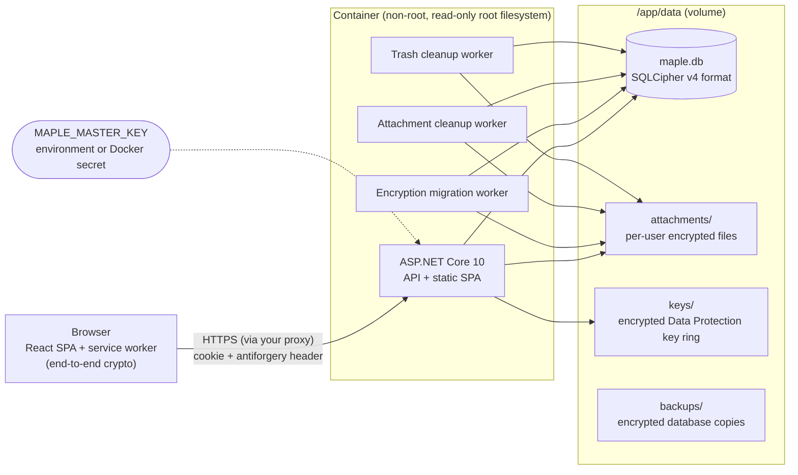

# Maple Notes architecture

This document describes how Maple Notes is built and why. It is written for contributors and for operators who
want to understand exactly what the encryption does and does not protect. The history of changes is in
[CHANGELOG.md](../CHANGELOG.md). The end-to-end encryption formats are specified in [e2ee-spec.md](e2ee-spec.md), and
what they protect against in [threat-model.md](threat-model.md). Third-party licensing is in
[licensing.md](licensing.md).

## Overview

One process serves everything: an ASP.NET Core 10 server hosts the REST API and the compiled React single-page
app. All state lives in one directory (`/app/data` in the container). The only secret needed to read it,
`MAPLE_MASTER_KEY`, is supplied at runtime and never stored there.



### Source layout

| Path | Contents |
|---|---|
| `src/MapleNotes.Server/Program.cs` | Entry point: command-line modes, middleware pipeline, service registration. |
| `src/MapleNotes.Server/Domain/` | Entities: `User` (with `UserPreferences`), `Note` (with `NoteKind`), `Attachment`, `Tag`, `Label`, `InstanceSetting`. |
| `src/MapleNotes.Server/Features/` | One folder per feature: `Auth`, `Admin`, `Notes` (including daily notes, restoring and the trash), `Labels`, `Attachments`, `Encryption`, `EndToEnd` (key material, recovery, browser conversion), `Export`, `Preferences`. Each has its controller, request/response records and service. |
| `src/MapleNotes.Server/Infrastructure/` | Cross-cutting code: `Configuration`, `Crypto`, `Persistence` (EF Core, migrations, backups), `Storage` (attachment files), `Hosting`, `Web` (auth, antiforgery, security headers, rate limits). |
| `src/maple-web/` | React + TypeScript + Vite + Tailwind CSS single-page app. |
| `src/maple-web/src/crypto/` | Browser cryptography: Argon2id in a Web Worker, HKDF, envelopes, the attachment format, recovery keys, key storage, and the shared test vectors. |
| `src/maple-web/src/lib/` | API client, sign-in (`auth.ts`), end-to-end session (`e2ee.ts`), encryption at the API boundary (`noteCrypto.ts`), browser conversion (`conversion.ts`), habits (`habits.ts`: a habit's text, streaks and chart periods), the save queue that todo lists, habits and checkboxes ticked in notes share (`noteEditor.ts`), the side menu's items and order (`menu.ts`), label colours (`labels.ts`), tag suggestions (`tagSuggest.ts`, `caret.ts`), and loading only what is near the screen (`viewport.ts`). |
| `src/maple-web/src/sw/` | The service worker (`/sw.js`, built separately by `vite.sw.config.ts`): keeps the app and recently read notes for offline reading, decrypts end-to-end media and streams browser exports. |
| `src/maple-web/src/export/` | The browser export, a port of the server's, with the shared export vectors. |
| `src/maple-web/src/import/` | Restoring: a ZIP reader, the parser for every export format and for single files, and the runner that restores notes through the API. |
| `src/maple-web/src/pages/` | Home (with today's daily note), Todo, Quick notes, Habits (with the progress chart and a month calendar), Archive, Settings, Help, and the sign-in, unlock and recovery screens. |
| `tests/MapleNotes.Server.Tests/` | Unit and integration tests (xUnit v3, `WebApplicationFactory`). |
| `scripts/` | License check and third-party notice generator. |
| `site/` | The project website, published to GitHub Pages by `.github/workflows/pages.yml` with the app's icon and the README screenshots. |

### Request pipeline

`ForwardedHeaders` (trusted proxies only) → security headers → exception handler (RFC 9457 problem details) →
HSTS (HTTPS only) → static files → routing → rate limiter → authentication → authorization → controllers.
Every controller action requires a signed-in user unless marked `[AllowAnonymous]`, and every state-changing request
must carry a valid antiforgery token. Both are enforced globally, so a new endpoint is secure by default.

## Data

### Model

| Entity | Notes |
|---|---|
| `User` | Username (unique, case-insensitive), PBKDF2 hash of the key derived from the password with its Argon2id salt and parameters, role, encryption mode (`Off`, `AtRest`, `EndToEnd`), server-held wrapped data key (absent once an end-to-end account needs none), end-to-end key material (the browser's data key wrapped by the password and by the recovery key, and a hash of the recovery authentication key), security stamp, lockout state, and `Preferences` (titles, date format, which features are on, theme, accent colour and the side menu's order; one JSON column, plain in every mode). |
| `Note` | Owner, content bytes, `Scheme` (`None`, `Server`, `EndToEnd`), `Kind` (`Note` for the timeline, `Todo`, `Quick`, `Habit`), `DailyDate` (a daily note's day; unique per owner, given up when the note goes to the trash), pinned, `ArchivedAtUtc` (archive = soft delete), `TrashedAtUtc` (in the trash; deleted for good 30 days later by the trash cleanup worker), timestamps, `Revision` (concurrency token). A title is not a column: it is the text's first line written as a `# heading`, a todo list is a Markdown task list, and a habit is a `# name` followed by one `- yyyy-MM-dd` line per day done, so all of them are encrypted and exported like any text. A habit never changes kind. |
| `Attachment` | Owner, optional note, sanitized file name, content type, size, storage key, `Scheme`, `Revision`. End-to-end files store a placeholder name and type, and their real ones encrypted in `EncryptedMetadata`. |
| `Tag` / `NoteTags` | Per-user tags parsed from `#tags` in note text. Tags of end-to-end notes have no name: a blind token (HMAC) and the name encrypted by the browser. |
| `Label` / `NoteLabels` | Per-user coloured labels put on notes by hand: a name (or, for end-to-end accounts, the name encrypted by the browser for the label's ID) and one of ten colours. At most 100 per account and 20 per note. |
| `InstanceSetting` | Runtime settings changed by administrators (open registration). |

All IDs are UUID version 7, so they sort by creation time. Every query that touches notes, tags or attachments filters
by the signed-in owner; requests for another user's items return 404, never 403, so their existence is not revealed.

### Feed pagination

The feed uses keyset (cursor) pagination on `(CreatedAtUtc, Id)` descending, backed by an index on
`(UserId, CreatedAtUtc, Id)`, and one on `(UserId, Kind, CreatedAtUtc, Id)` for the timeline and the Todo, Quick
notes and Habits tabs, which each list one kind. A cursor is the position of the last item shown, so notes posted
while the user scrolls never shift later pages. Pinned notes are a separate list shown above the feed. The trash is
listed most recently deleted first, with the same kind of cursor on `(TrashedAtUtc, Id)`.

A third index, `(UserId, Kind, IsPinned, ArchivedAtUtc, TrashedAtUtc, CreatedAtUtc, Id)`, serves the feed and pinned
lists and the tag and label counts from the index alone. The list queries compare `IsPinned` with a parameter rather
than as a bare flag, because SQLite can only seek an index on an equality. Tag and label counts are one grouped query
over the links. With 3,000 notes (1,200 of them with files), measured in-process before and after 1.8: the first
feed page 2 ms both times, the pinned list 29 ms → 1.5 ms, the tag counts 5 s → 5 ms. Reading a note's row
means decrypting its database pages, which is what made per-tag subqueries over every note so slow.

In the browser, the lists load 20 notes at a time as the end of the list comes within 600 px. Each card is laid out
only when near the screen (`content-visibility: auto`). Pictures load lazily, and players, end-to-end decryption in
the page and link previews start only when their note is within 800 px (`useNearViewport`).

Searches, tag views, tag counts and the archive cover every kind the user has turned on, except habits: only the
Habits page lists them, loading them all, oldest first, and it draws the progress chart in the browser from their
text. The side-menu calendar counts active notes per day with `GET /api/v1/notes/calendar`, which converts creation
times to the browser's time zone on the server (a month at a time, at most 62 days); a day's notes are the feed
filtered by `createdFrom`/`createdBefore`, the instants that day starts and ends on the device.

Search runs over decrypted text, so it cannot use the database. It scans the user's notes in batches of 200 and
decrypts them in memory, scanning at most 5,000 notes per request. If it reaches that limit it returns what it has
found plus a cursor to continue from, so response time stays bounded on large accounts. The server cannot search
end-to-end notes; for those accounts the web app pages through the feed and searches the decrypted text itself.

### Files on disk

```text
/app/data/
├── maple.db, maple.db-wal          database (SQLCipher v4 format, WAL mode)
├── attachments/2d/1c/<id>-<suffix>.bin
├── keys/key-<guid>.xml             Data Protection keys, each encrypted (see below)
└── backups/maple-<time>-<reason>.db encrypted database copies (the newest 5 are kept)
```

Attachment files are sharded by the random tail of their ID. Every write of a file's content gets a fresh random
suffix, which is what makes crash-safe re-encryption possible (see below). Storage keys are validated against a strict
pattern before use, so a tampered database row cannot point outside the attachments directory.

## Cryptography

### Key hierarchy


Each derived key uses its own HKDF label (`maple-notes/v1/...`), so learning one key reveals nothing about the others
or the master key.

Accounts with end-to-end encryption have a second hierarchy that lives in the browser. Its root is independent of the
master key, and the server only ever sees it wrapped ([e2ee-spec.md](e2ee-spec.md) §1, §3, §6):


The sign-in key hierarchy (password → `authKey`) applies to every account; the wrapping and data keys exist only once
an account has turned on end-to-end encryption.

### Database

The whole SQLite file is encrypted by [SQLite3 Multiple Ciphers](https://utelle.github.io/SQLite3MultipleCiphers/),
configured for the SQLCipher v4 format (AES-256-CBC pages with HMAC-SHA512). A raw 256-bit key is used instead of
a passphrase: the key is already high-entropy, and skipping SQLCipher's PBKDF2 makes opening a connection about 100×
cheaper. The official `sqlcipher` tool opens the file with `PRAGMA key = "x'<hex key>'";`, which gives an
independent recovery path. `secure_delete` is on, so deleted content is overwritten rather than left in free pages.

### Note envelope (AES-256-GCM)

```text
[0]      format version (1)
[1]      key version
[2..13]  96-bit random nonce
[14..29] 128-bit authentication tag
[30..]   ciphertext
```

The header bytes are authenticated together with the associated data `maple-notes/v1/note/{userId}/{noteId}`. A
ciphertext copied onto another note or into another account therefore fails to decrypt instead of showing the wrong
content. Wrapped data keys and Data Protection keys use the same envelope with their own associated data.

### Attachment stream format (chunked AES-256-GCM, STREAM construction)

```text
header (42 bytes): "MNAE" | version (1) | key version | chunk size (uint32, 65,536) | 32-byte random salt
chunk i:           ciphertext (≤ 64 KiB) | 16-byte tag
nonce of chunk i:  7 zero bytes | i (uint32, big-endian) | final-chunk flag
```

Each file has its own key, `HKDF(user data key, salt, "maple-notes/v1/attachment")`, so nonces can never repeat
across files. Each chunk also authenticates the header and the owner and attachment IDs. This design provides:
- constant memory for any file size;
- detection of modified, reordered, truncated or extended files;
- random access. `DecryptingAttachmentStream` is seekable and decrypts only the chunks a request touches, which is
  what lets downloads honour HTTP Range requests, needed for video seeking on iOS Safari.

### Data Protection key ring

ASP.NET Core Data Protection keys sign the session cookie and antiforgery tokens. On Linux they are normally stored
unencrypted. Maple Notes wraps each key with the Data Protection wrapping key before writing it, so a copy of the data
volume cannot be used to forge a session.

### What the encryption protects

| Threat | Off / encrypted at rest | End-to-end |
|---|---|---|
| Stolen disk, copied volume or leaked backup (without the master key) | **Protected.** The database, attachments and key ring are all ciphertext. | **Protected**, twice over. |
| Someone who knows the master key, or reads the server's memory or data while it runs | **Not protected.** The server holds the keys. | **Protected.** The server never has the key; it sees ciphertext, sizes, timestamps, and which notes share a tag. |
| Someone who takes over the server and changes the web app it serves | **Not protected.** | **Not protected** once the user signs in or unlocks with the modified app, which could capture the password. See [threat-model.md](threat-model.md). |
| Tampering with stored ciphertext | **Detected.** Authenticated encryption everywhere. | **Detected**, in the browser. |
| An administrator reading users' notes through the app | **No API exists** for it. | Impossible without the user's password or recovery key. |
| Leftover copies after account deletion | **Unreadable.** Deleting the account destroys its wrapped data key; database backups made before the deletion still contain it until they are rotated out. | Backups keep the wrapped keys, which open only with the password or recovery key of that time. |

Each account chooses its mode in Settings; the database is always encrypted. [threat-model.md](threat-model.md)
covers each adversary, what end-to-end encryption still reveals, and its limits.

## Encryption modes and migration

Every account has a mode: `Off`, `AtRest` (encrypted by the server with a key it holds) or `EndToEnd` (encrypted by
the browser with a key the server never sees; see [e2ee-spec.md](e2ee-spec.md)). Every note and attachment records its
own scheme (`None`, `Server` or `EndToEnd`), so content stays readable while an account changes mode.

Switching encryption at rest on or off (proof of the password required) only changes `User.EncryptionMode`; new
content follows the new mode at once. The background `EncryptionMigrationService` brings existing content in line. It
runs at startup, when signalled by a change, and every five minutes. It converts every note and attachment whose
scheme (`None` or `Server`) does not match the account's mode. Because the target is re-read before every batch and
every item records its own state, the process is resumable, idempotent and self-correcting: flipping the setting back
mid-way simply converges the other way. The server never touches end-to-end content or the content of end-to-end
accounts: it cannot read the former, and in end-to-end mode it accepts new content only as ciphertext (plain text gets
HTTP 409).

Content is converted to and from end-to-end encryption by the browser, which holds the key: it fetches batches from
`/api/v1/account/conversion`, converts each note or file and sends it back, one atomic request per item, while the app
is open (`src/maple-web/src/lib/conversion.ts`). A note converts only if it was not edited meanwhile, keeping its
timestamps; files are replaced through a new storage key. The server then deletes keys nothing needs any more: its own
data key once an end-to-end account has no server-encrypted item left, or the end-to-end key material once an account
that left end-to-end mode has no end-to-end item left
([e2ee-spec.md §3](e2ee-spec.md#3-the-e2ee-data-key-and-its-subkeys)).

For an end-to-end account the web app encrypts and decrypts at its API boundary (`src/maple-web/src/lib/noteCrypto.ts`),
so the rest of the interface works with plain notes: new notes get an ID chosen in the browser, tags become blind
tokens with encrypted names, tag filters send tokens, search runs in the browser over decrypted pages of notes, and
files are encrypted with their names before upload.

Crash safety:
- **Notes** convert in batches of 100, each saved in one transaction. A crash rolls the whole batch back.
- **Attachments** are written as a new file under a new storage key. Only then is the database row switched to the
  new key and state (a single update), and only after that is the old file deleted. At every instant the row points at
  a complete file. A leftover copy from a crash is an orphan, removed by the hourly `AttachmentCleanup`.
- **Concurrent edits** are caught by the `Revision` concurrency token, which `MapleDbContext` increments on every
  update. If a user saves a note while it is being converted, the conversion fails and is retried on the next pass.
  The user's edit is never overwritten. The API reports such races as HTTP 409.
- **Damaged items** (unreadable ciphertext or a missing file) are logged and skipped, so they cannot stall the rest.

These cases are covered by tests that simulate a crash after a converted file is written, a crash in the middle of a
note transaction, and a concurrent edit.

## Authentication and sessions

- Key-derived sign-in ([e2ee-spec.md §1](e2ee-spec.md#1-password-derived-keys-every-account)): the password never
  reaches the server. The browser asks `POST /api/v1/auth/prelogin` for the account's Argon2id parameters (64 MiB,
  3 passes, a random 16-byte salt per account), derives a master secret in a Web Worker, and splits it with HKDF into
  an authentication key, which it sends, and a wrapping key, which stays in the browser for end-to-end encryption.
  Registration, password changes and every password confirmation work the same way. Password rules (at least 10
  characters) are therefore checked by the web app.
- The server stores the authentication key only as a hash: ASP.NET Core Identity's hasher, PBKDF2-HMAC-SHA512 with
  210,000 iterations (the OWASP recommendation). Hashes with older parameters are upgraded at the next sign-in.
  Accounts created by 1.0.0 keep their password hash, marked `LegacyPassword`, until their next sign-in sends the
  password once with the new key.
- Prelogin and sign-in answer identically for unknown users and wrong passwords, including timing: unknown usernames
  get the default parameters with a stable pseudo-salt derived from the prelogin key, and are checked against a dummy
  hash. Five consecutive failures lock the account for 15 minutes, and prelogin and the authentication endpoints are
  rate-limited per client IP (`MAPLE_AUTH_RATE_LIMIT`, a separate budget for each).
- Session cookie: `HttpOnly`, `SameSite=Strict`, `Secure` over HTTPS, 30-day sliding expiry with "keep me signed
  in", otherwise a browser-session cookie. It is validated against the database on **every** request, so a
  password change, "sign out everywhere", disabling or deleting an account takes effect immediately.
- CSRF: `SameSite=Strict`, plus an antiforgery token in the `X-XSRF-TOKEN` header on every state-changing
  request. The export download is a GET that changes nothing, and a cross-site request never carries the
  SameSite=Strict cookie.
- The first account becomes the administrator. The last active administrator cannot delete their own account,
  because the next visitor could otherwise claim the instance by creating the first account.

## Uploads and downloads

Uploads are parsed with `MultipartReader` and streamed straight to storage, encrypting on the way when required.
MVC's form binding is disabled for that action so the body is never buffered. A counting stream enforces
`MAPLE_MAX_UPLOAD_MB` while reading. File names are sanitized.

With **Shrink photos before uploading** on, the web app shrinks still images before they upload
(`src/maple-web/src/lib/shrinkPhoto.ts`): it decodes them upright with `createImageBitmap`, draws them with high-quality
smoothing at most the chosen photo size's longest side, and re-encodes them as JPEG at that size's quality: Large is 2560
pixels at 85%, Medium 1920 at 80% and Small 1280 at 75% (the `photoSize` preference). Presets rather than a free ratio,
as photo and messaging apps offer, because size and quality only work well in matching pairs. It keeps the original when the browser cannot
decode it, when it has transparent pixels, or when the result is not at least a tenth smaller. The server sees only
an ordinary upload, and for end-to-end accounts the shrunk file is what gets encrypted.

Downloads display only passive media inline: common image, audio and video types, and plain text. Everything else,
including SVG and HTML, is sent as a download with a generic content type. Each download also carries `nosniff` and
`Content-Security-Policy: default-src 'none'; sandbox`, so an uploaded file can never run script in the app's origin.

End-to-end files are encrypted in the browser before upload and served back as ciphertext. The web app's media
service worker (`src/maple-web/src/sw`) decrypts them for the page at `/e2ee/attachments/{id}`, fetching only the
chunks a request needs, so video seeks without a full download; it applies the same inline rules and headers. Without
the worker, the page decrypts whole files into `blob:` URLs ([e2ee-spec.md §5](e2ee-spec.md#5-attachments)).

## Export

`GET /api/v1/export` streams a ZIP archive. Notes are read in batches of 200 in chronological order and decrypted in
memory, and attachments are decrypted chunk by chunk. File names derive from the note's local creation time and first
line (`2026-09-28_1430_buy-maple-syrup.md`). They are safe on Windows, macOS and Linux, and made unique
case-insensitively. Folders follow the chosen layout; todo lists, quick notes and habits go under `todo/`,
`quick-notes/` and `habits/`. Attachments go to `attachments/` and are linked from notes by relative path. Every
format records each note's ID (the manifest does for plain text), kind, daily date and labels. Labels are written by
name, in ordinal order, since label IDs belong to one account: as a JSON array in Markdown front matter (`labels:`),
plain text (`Labels:`, only when there are any) and JSON. `manifest.json` (version 3) describes the export, lists every
note, lists any damaged files, and lists the labels the exported notes carry with their colours. An account with
end-to-end label names is exported by the browser, like one with end-to-end notes or files.

.NET's `ZipArchive` still performs some synchronous writes internally, which ASP.NET Core forbids on the response. The
archive is therefore produced on a background task into a bounded in-memory pipe (about 1 MB) that the request copies
to the client asynchronously. Memory use stays flat for any export size, and decrypted data never touches the disk.

The server cannot read end-to-end content, so it refuses to export an account that has any (HTTP 409); the web app
builds the same archive in the browser instead (`src/maple-web/src/export`, using fflate). It is a line-by-line port
of the server's naming and formatting, including .NET's JSON escaping, casing and whitespace rules, and it is checked
against the server: a C# test writes the server's archives for a tricky dataset (time zones across a New Year and a
daylight-saving change, slug collisions, Unicode, awkward file names) into `export-vectors.json`, and the web tests
reproduce all 12 format and layout combinations entry by entry. The archive is streamed to disk through the media
service worker (`/e2ee/export/{id}`, opened in a hidden iframe, since browsers do not pass `<a download>` requests to
service workers); without the worker it is assembled in memory.

## Restore

Restoring is done by the browser for every account, so end-to-end accounts work the same way
(`src/maple-web/src/import`). It reads Maple Notes exports in any format and layout, and single Markdown, text and JSON
files; a ZIP without a manifest is read as a folder of such files. A small ZIP reader reads the archive's central
directory, then one entry at a time from the chosen file, so a large export is never held in memory whole.

The browser first asks `POST /api/v1/notes/import/existing` which of the export's note IDs the account already has, and
skips those. For the rest it uploads each note's files like any upload, then sends the note to
`POST /api/v1/notes/import` with its original ID, dates, pinned and archived state, kind, daily date and labels, as
plain text or, for end-to-end accounts, encrypted in the browser for that ID. Before that, the browser matches the label
names the notes carry to the account's labels (ignoring case and surrounding spaces) and creates the missing ones in
the colour the manifest records, encrypting their names for end-to-end accounts; a label it cannot create, for example
past the account's 100, is reported and the notes arrive without it. The server never reuses another account's ID and
never says whether one exists: a plain note gets a new ID, and an end-to-end note answers 409 and is encrypted again
for a new one. A daily date already taken in the account is dropped, so the note arrives as an ordinary one.

The web tests restore every archive in the shared export vectors and compare each note with the original, and a
browser test restores an export into fresh instances (one of them end-to-end) and exports them again, getting the same
archive.

## Link previews

`GET /api/v1/link-preview?url=` returns a page's title, description and site name. It is available only when the
server allows it (`MAPLE_LINK_PREVIEWS`) and the account turned it on. The server fetches the page itself, so the
browser never contacts other sites and the Content-Security-Policy stays closed. The fetch is guarded against
server-side request forgery (`Features/LinkPreviews/NetworkGuard.cs`):
- Only http(s) links on ports 80 and 443, without user names, are allowed. Names such as `localhost`, `*.local` and
  `*.internal`, and private address literals, are refused before anything is sent.
- The HTTP client's `ConnectCallback` resolves the name and connects to a public address only: not loopback,
  private, link-local (including cloud metadata), carrier-grade NAT, reserved, multicast, IPv6 local or documentation
  ranges, nor IPv4 addresses embedded in IPv6. The check runs on the address actually used, so DNS rebinding cannot
  get around it.
- Redirects are followed by hand, at most three, each checked again.
- A fetch reads at most 512 KB of HTML within 5 seconds, sends no cookies and uses no proxy.
- Results, including "no preview", are cached in memory, and each user may ask for 60 previews a minute.

The HTML is read with a few regular expressions (Open Graph tags, then `<title>` and the description), never
executed, and the text is shown as plain text.

## Branding

Administrators can rename the app and replace its icon; both are instance settings and come with the sign-in status
(`branding`), so the sign-in page shows them. The name is plain text, at most 40 characters on one line, and the web
app only ever renders it as text. The icon is fitted into 256 × 256 pixels in the browser, and the server accepts it
only as a PNG, JPEG or WebP image of at most 256 KB, recognised by its first bytes (so never SVG or anything that
could run). It lives in the database, is served at `GET /api/v1/branding/icon` with the attachments' sandboxing
Content-Security-Policy, and is linked with a version taken from its hash, so browsers can cache it for good. The
server's version comes with the status only for signed-in users.

The web app manifest (`GET /manifest.webmanifest`, which lets browsers install the app) is built from the same
settings: the app's name, and the custom icon when it is at least 144 pixels on its shorter side (the server reads the
size from the image's header). Otherwise it lists the app's own icons: PNGs at 192 and 512 pixels and a maskable one
for Android, rendered from `favicon.svg` and kept in `public/icons`. On iPhone, the home-screen icon and title come from
`apple-touch-icon` and `apple-mobile-web-app-title` in the page, which the web app points at the custom icon and name.
Installing needs no service worker; the service worker that every account registers is for offline reading (below).

## Offline reading

Every account's browser registers the service worker (`/sw.js`, `src/maple-web/src/sw/offline.ts`), which keeps two
things in the browser's Cache Storage for when the server cannot be reached:

- **The app.** When a new worker installs it saves the page and every file of the build (scripts, styles, icons, the
  web app manifest). `vite.sw.config.ts` lists them into the worker at build time; their names carry content hashes,
  so each release that changes them is a new worker, which saves the new files and deletes the old ones. Any page of
  the app opens from the saved page when the server does not answer.
- **What the account last read.** Sign-in status, note lists (including daily notes, habits and the calendar), tags,
  labels and the encryption status, exactly as the server sent them, so end-to-end notes stay encrypted. At most 300
  reads are kept, the least recently read going first. Searches, files, the session's secret, link previews and
  administration are never kept.

Reads still go to the server first; the saved copy answers only when the request fails, marked with
`X-Maple-Offline: 1`, and the app then shows a notice that it is offline. The worker never answers writes; how the app
keeps them is below.

The worker decides what to keep from the sign-in status it passes on. It keeps copies only when the status shows a
signed-in account whose session was started with "keep me signed in" (`sessionPersistent`), and records that account,
its username and its encryption mode. A status without them, another account, another mode, a 401 on a read, or a
sign-out request (`POST /api/v1/auth/logout`, `/sign-out-everywhere`, `DELETE /api/v1/account`, deleted before the
request is even sent) deletes every copy; a read that was on its way when that happened is not saved. A session that
ends with the browser therefore leaves nothing behind, and a change of mode never leaves plain copies of notes that are
now end-to-end encrypted. Requests made before the worker first controlled the page went past it, so the page fetches
the status and its lists again when that happens.

End-to-end accounts open offline on the unlock screen, because the session's secret that opens the saved key
([e2ee-spec.md §7](e2ee-spec.md#7-keeping-the-key-in-the-browser)) is never kept. The password unlocks them there with
the account's Argon2id parameters (from `POST /api/v1/auth/prelogin`, kept for the recorded username only) and the
wrapped key (`GET /api/v1/account/e2ee`), which the app fetches once per visit so that they are saved. Offline, a POST
cannot get an antiforgery token, so the app sends it without one and the worker answers it from the saved copy.

## Writing offline

On a device that keeps notes for offline reading, a new note or new text for a note that cannot reach the server (no
answer, or 502, 503 or 504 from a proxy) is kept in the page's IndexedDB (`maple-notes-outbox`, `src/maple-web/src/lib/outbox.ts`)
and the save succeeds. Other changes (pinning, archiving, labels, the trash, files) still need the server. Each note
has at most one waiting change:

- **A new note** gets its ID in the browser (a UUID version 7) and keeps it. It is sent through `POST
  /api/v1/notes/import`, which keeps the ID and the time it was written and does nothing for a note the account already
  has, so a send whose answer was lost does not add it twice. A daily note keeps its day unless another device started
  that day's note meanwhile, and then becomes an ordinary note.
- **New text for an existing note** records the note's `updatedAtUtc` as the page last saw it, and is sent with `PUT
  /api/v1/notes/{id}` and that value as `expectedUpdatedAtUtc`. The server refuses it with 409 when the note has been
  edited since. The app then fetches the note: if it already has this text (our own earlier send whose answer was
  lost), nothing more is done; otherwise the text is saved as a separate new note, so neither version is lost, and the
  app says so. A note deleted meanwhile (404) gets the same treatment.

Further edits of a waiting note replace its text, and while a note has a change waiting every save of it goes to the
outbox, so changes reach the server in the order they were made. A change sent while a newer edit arrived stays as an
edit of the version the server just returned.

The app sends waiting changes while it is open and the account's notes can be read (the shell is shown): at once, when
the browser reports it is online, when the app is shown again, after a save of a note that has a waiting change, and
every 30 seconds while anything waits. A failure to reach the server, a server error, a full account or a session
that must sign in again stops the round and leaves the changes for the next one; any other refusal drops that change
and shows the server's message. The note lists show waiting changes on the notes they belong to, and new notes at
the top of the first page of the lists they belong in, marked "Not saved yet".

The outbox follows offline reading's rules. Changes are kept only when the session was started with "keep me signed
in", and only for the signed-in account: another account signing in on the device deletes them. Signing out (after
asking, while changes wait), signing out everywhere, deleting the account and deleting all its content delete them.
For an account whose browser holds the end-to-end key the text is kept encrypted for the note, with the note
envelope ([e2ee-spec.md §2](e2ee-spec.md#2-envelope-aes-256-gcm)), and decrypted only to be encrypted again for the request,
according to the account's mode at that moment.

## Storage usage

`GET /api/v1/account/storage` sums the signed-in account's stored note bytes (ciphertext for encrypted notes) and file
sizes, with counts, in two database queries. `GET /api/v1/admin/storage`, for administrators, measures the data volume
itself: the database and its write-ahead log, the attachment and backup directories, and the free space the container
sees on the volume. It deliberately reports totals only; no endpoint gives one account's usage to anyone else.

Administrators can set a storage limit for every account (`StorageQuotaMb` in `InstanceSettings`, absent for none).
It counts exactly what `GET /api/v1/account/storage` counts, and `Features/Storage/StorageQuota.cs` enforces it on
everything that adds data: an upload streams under `min(MAPLE_MAX_UPLOAD_MB, room left)`, and creating, restoring or
lengthening a note claims its extra bytes, less any files the same edit removes. A change that does not fit gets HTTP
507. Each account's checks and the saves they guard run one at a time (a lock per account), so two uploads at once
cannot both take the last of the room. Conversions between encryption modes never check the limit: they make files a
little larger, and an account must always be able to change its protection. Lowering the limit deletes nothing; the
account just cannot grow until it is back under it.

`DELETE /api/v1/account/content`, with proof of the password, deletes all of an account's notes, tags and files in one
transaction, then the files on disk, and keeps the user row: sign-in details, encryption keys and preferences stay, and
sessions carry on. `POST /api/v1/admin/storage/compact` runs SQLite's `VACUUM`, which rebuilds the database without
the pages deleted content freed (they are already overwritten, since `secure_delete` is on) and keeps its encryption,
then truncates the write-ahead log, so the space goes back to the volume. One compaction runs at a time.

## Background services

| Service | When | What |
|---|---|---|
| `StartupInitializer` | Before anything else starts | Validates settings and the master key, creates the data layout, backs up and migrates the database. Problems stop startup with a one-line message. |
| `EncryptionMigrationService` | Startup, on a mode change, every 5 minutes | Converts content between `None` and `Server` to match each account's mode. The browser converts to and from end-to-end encryption. |
| `AttachmentCleanupService` | Startup, then hourly | Removes uploads never attached to a note (after 24 h), orphan files (after 1 h) and interrupted writes. |

## HTTP hardening

- Every response sets `Content-Security-Policy` (scripts and workers from the app's own origin only, no inline
  script, no `eval`, no framing; `'wasm-unsafe-eval'` lets the Argon2id worker compile WebAssembly),
  `X-Content-Type-Options`, `X-Frame-Options`, `Referrer-Policy: no-referrer`, `Permissions-Policy` and
  `Cross-Origin-Opener/Resource-Policy`.
- API responses carry `Cache-Control: no-store` unless they set their own, so decrypted notes are not kept in the
  browser's disk cache. Offline reading keeps some of them deliberately, in the service worker's cache, under the
  rules above. Decrypted attachments are `no-store` too. End-to-end attachments, which download as
  ciphertext, are the exception: they are cached as immutable under URLs that change with the stored bytes
  (`?v={Revision}`).
- HSTS is sent on HTTPS requests outside Development.
- Request bodies are limited to 2 MB except uploads.
- `X-Forwarded-*` headers are honoured only from `MAPLE_TRUSTED_PROXIES`.
- `/healthz` verifies that the database can actually be decrypted, not just opened.

## Testing

- **Server:** about 470 xUnit tests.
  - Crypto primitives, including tampering, truncation, reordering, wrong keys and every chunk boundary.
  - The storage layer and startup, including the upgrade of a 1.0 database.
  - API behaviour through `WebApplicationFactory`: authentication (key-derived sign-in, legacy upgrade, unknown
    users), isolation between users, notes, attachments, encryption migration with crash simulation, and export across
    every format and layout; preferences, kinds (including habits), daily notes (including two devices at once),
    restoring, storage limits (including two uploads at once), deleting all of an account's content, compacting
    the database (which must stay encrypted), the trash (lists, restoring, emptying, deleting after 30 days, daily
    notes, exports) and labels (limits, filters, counts, privacy between accounts).
  - End-to-end encryption, with a C# implementation of the browser's side: key setup, unlock, recovery, notes, tags,
    label names and files as ciphertext, conversion in both directions (interrupted, concurrent edits, key cleanup),
    and a scan of the raw database for the plain text.
  - The real server binary run as a process, for command-line behaviour.
- **Shared vectors:** `test-vectors.json` (every end-to-end derivation and format) and `export-vectors.json` (the
  server's export archives) are written by the C# tests and checked by the web tests, so both implementations agree
  byte for byte.
- **Web:** about 295 Vitest and Testing Library tests: the crypto against the vectors, key storage, the API boundary,
  conversion, the service worker's range decryption and offline reading (what is kept, for whom, and when it is
  deleted), writing offline (what is kept, how it shows, sending, conflicts, encryption on the device), the browser export against the server's archives, restoring
  those archives, Markdown safety and checkboxes ticked in notes, the composer with titles and tag suggestions, the
  caret at the end when editing, todo lists (also edited as Markdown), quick and daily notes, double-tap to edit,
  habits and their chart, labels, the trash with Undo, the menu's order, loading media only near the screen, shrinking
  photos, preferences, storage limits, and the sectioned settings and recovery screens.
- **Releases:** additionally tested in a real browser (Playwright, Chromium) against the built container at desktop
  and 375 px widths, including end-to-end setup, unlock, recovery, video seeking, mode changes, export, the 1.2
  to 1.4 features, and export → restore round trips.

## Operations

- **Backups:** `docker exec maple-notes dotnet /app/MapleNotes.Server.dll backup` writes a consistent, encrypted
  copy of the database while the server runs. Copy `backups/`, `attachments/` and `keys/` from the volume. Store the
  master key separately from these files.
- **Upgrades:** schema migrations run automatically at startup, after an automatic encrypted backup.
- **Key rotation:** not implemented. The formats are versioned (key version bytes in every envelope and file header)
  so rotation can be added without migrating the format. Changing the password re-wraps an end-to-end data key but
  does not replace it.
