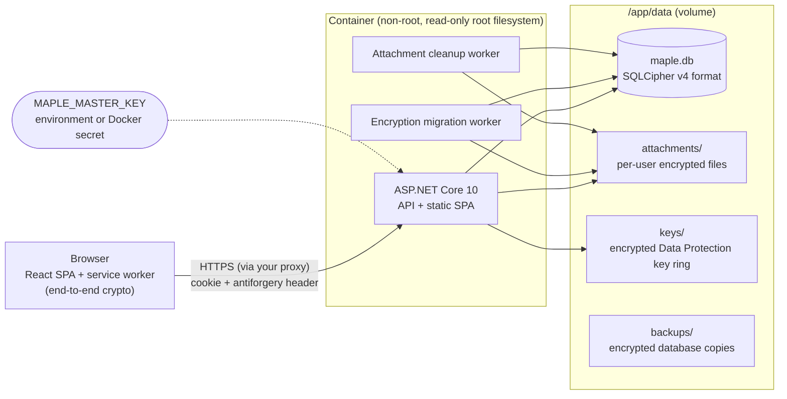
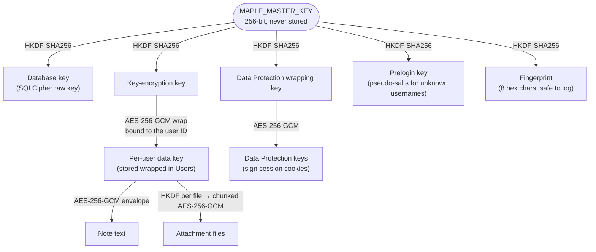
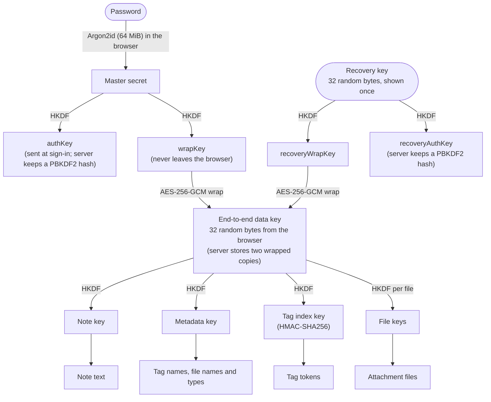

# Maple Notes architecture

This document describes how Maple Notes is built and why. It is written for contributors and for operators who
want to understand exactly what the encryption does and does not protect. The plans and history live in
[PLAN.md](PLAN.md), [PLAN-E2EE.md](PLAN-E2EE.md) and [../CHANGELOG.md](../CHANGELOG.md). The end-to-end encryption
formats are specified in [e2ee-spec.md](e2ee-spec.md), and what they protect against in
[threat-model.md](threat-model.md). Third-party licensing is in [licensing.md](licensing.md).

## Overview

One process serves everything: an ASP.NET Core 10 server hosts the REST API and the compiled React single-page
app. All state lives in one directory (`/app/data` in the container). The only secret needed to read it,
`MAPLE_MASTER_KEY`, is supplied at runtime and never stored there.



### Source layout

| Path | Contents |
|---|---|
| `src/MapleNotes.Server/Program.cs` | Entry point: command-line modes, middleware pipeline, service registration. |
| `src/MapleNotes.Server/Domain/` | Entities: `User`, `Note`, `Attachment`, `Tag`, `InstanceSetting`. |
| `src/MapleNotes.Server/Features/` | One folder per feature: `Auth`, `Admin`, `Notes`, `Attachments`, `Encryption`, `EndToEnd` (key material, recovery, browser conversion), `Export`. Each has its controller, request/response records and service. |
| `src/MapleNotes.Server/Infrastructure/` | Cross-cutting code: `Configuration`, `Crypto`, `Persistence` (EF Core, migrations, backups), `Storage` (attachment files), `Hosting`, `Web` (auth, antiforgery, security headers, rate limits). |
| `src/maple-web/` | React + TypeScript + Vite + Tailwind CSS single-page app. |
| `src/maple-web/src/crypto/` | Browser cryptography: Argon2id in a Web Worker, HKDF, envelopes, the attachment format, recovery keys, key storage, and the shared test vectors. |
| `src/maple-web/src/lib/` | API client, sign-in (`auth.ts`), end-to-end session (`e2ee.ts`), encryption at the API boundary (`noteCrypto.ts`), browser conversion (`conversion.ts`). |
| `src/maple-web/src/sw/` | The service worker (`/sw.js`, built separately by `vite.sw.config.ts`): decrypts end-to-end media and streams browser exports. |
| `src/maple-web/src/export/` | The browser export, a port of the server's, with the shared export vectors. |
| `tests/MapleNotes.Server.Tests/` | Unit and integration tests (xUnit v3, `WebApplicationFactory`). |
| `scripts/` | License check and third-party notice generator. |

### Request pipeline

`ForwardedHeaders` (trusted proxies only) → security headers → exception handler (RFC 9457 problem details) →
HSTS (HTTPS only) → static files → routing → rate limiter → authentication → authorization → controllers. Every
controller action requires a signed-in user unless marked `[AllowAnonymous]`, and every state-changing request must
carry a valid antiforgery token. Both are enforced globally, so a new endpoint is secure by default.

## Data

### Model

| Entity | Notes |
|---|---|
| `User` | Username (unique, case-insensitive), PBKDF2 hash of the key derived from the password with its Argon2id salt and parameters, role, encryption mode (`Off`, `AtRest`, `EndToEnd`), server-held wrapped data key (absent once an end-to-end account needs none), end-to-end key material (the browser's data key wrapped by the password and by the recovery key, and a hash of the recovery authentication key), security stamp, lockout state. |
| `Note` | Owner, content bytes, `Scheme` (`None`, `Server`, `EndToEnd`), pinned, `ArchivedAtUtc` (archive = soft delete), timestamps, `Revision` (concurrency token). |
| `Attachment` | Owner, optional note, sanitized file name, content type, size, storage key, `Scheme`, `Revision`. End-to-end files store a placeholder name and type, and their real ones encrypted in `EncryptedMetadata`. |
| `Tag` / `NoteTags` | Per-user tags parsed from `#tags` in note text. Tags of end-to-end notes have no name: a blind token (HMAC) and the name encrypted by the browser. |
| `InstanceSetting` | Runtime settings changed by administrators (open registration). |

All IDs are UUID version 7, so they sort by creation time. Every query that touches notes, tags or attachments filters
by the signed-in owner; requests for another user's items return 404, never 403, so their existence is not revealed.

### Feed pagination

The feed uses keyset (cursor) pagination on `(CreatedAtUtc, Id)` descending, backed by an index on
`(UserId, CreatedAtUtc, Id)`. A cursor is the position of the last item shown, so notes posted while the user scrolls
never shift later pages. Pinned notes are a separate list shown above the feed.

Search runs over decrypted text, so it cannot use the database. It scans the user's notes in batches of 200 and
decrypts them in memory, scanning at most 5,000 notes per request. If it reaches that limit it returns what it has
found plus a cursor to continue from, so response time stays bounded on large accounts. The server cannot search
end-to-end notes; for those accounts the web app pages through the feed and searches the decrypted text itself.

### Files on disk

```text
/app/data/
├── maple.db, maple.db-wal          database (SQLCipher v4 format, WAL mode)
├── attachments/2d/1c/<id>-<suffix>.bin
├── keys/key-<guid>.xml             Data Protection keys, each encrypted (see below)
└── backups/maple-<time>-<reason>.db encrypted database copies (the newest 5 are kept)
```

Attachment files are sharded by the random tail of their ID. Every write of a file's content gets a fresh random
suffix, which is what makes crash-safe re-encryption possible (see below). Storage keys are validated against a strict
pattern before use, so a tampered database row cannot point outside the attachments directory.

## Cryptography

### Key hierarchy



Each derived key uses its own HKDF label (`maple-notes/v1/...`), so learning one key reveals nothing about the others
or the master key.

Accounts with end-to-end encryption have a second hierarchy that lives in the browser. Its root is independent of the
master key, and the server only ever sees it wrapped ([e2ee-spec.md](e2ee-spec.md) §1, §3, §6):



The sign-in key hierarchy (password → `authKey`) applies to every account; the wrapping and data keys exist only once
an account has turned on end-to-end encryption.

### Database

The whole SQLite file is encrypted by [SQLite3 Multiple Ciphers](https://utelle.github.io/SQLite3MultipleCiphers/),
configured for the SQLCipher v4 format (AES-256-CBC pages with HMAC-SHA512). A raw 256-bit key is used instead of
a passphrase: the key is already high-entropy, and skipping SQLCipher's PBKDF2 makes opening a connection about 100×
cheaper. The official `sqlcipher` tool opens the file with `PRAGMA key = "x'<hex key>'";`, which gives an
independent recovery path. `secure_delete` is on, so deleted content is overwritten rather than left in free pages.

### Note envelope (AES-256-GCM)

```text
[0]      format version (1)
[1]      key version
[2..13]  96-bit random nonce
[14..29] 128-bit authentication tag
[30..]   ciphertext
```

The header bytes are authenticated together with the associated data `maple-notes/v1/note/{userId}/{noteId}`. A
ciphertext copied onto another note or into another account therefore fails to decrypt instead of showing the wrong
content. Wrapped data keys and Data Protection keys use the same envelope with their own associated data.

### Attachment stream format (chunked AES-256-GCM, STREAM construction)

```text
header (42 bytes): "MNAE" | version (1) | key version | chunk size (uint32, 65,536) | 32-byte random salt
chunk i:           ciphertext (≤ 64 KiB) | 16-byte tag
nonce of chunk i:  7 zero bytes | i (uint32, big-endian) | final-chunk flag
```

Each file has its own key, `HKDF(user data key, salt, "maple-notes/v1/attachment")`, so nonces can never repeat
across files. Each chunk also authenticates the header and the owner and attachment IDs. This design provides:
- constant memory for any file size;
- detection of modified, reordered, truncated or extended files;
- random access. `DecryptingAttachmentStream` is seekable and decrypts only the chunks a request touches, which is
  what lets downloads honour HTTP Range requests, needed for video seeking on iOS Safari.

### Data Protection key ring

ASP.NET Core Data Protection keys sign the session cookie and antiforgery tokens. On Linux they are normally stored
unencrypted. Maple Notes wraps each key with the Data Protection wrapping key before writing it, so a copy of the data
volume cannot be used to forge a session.

### What the encryption protects

| Threat | Off / encrypted at rest | End-to-end |
|---|---|---|
| Stolen disk, copied volume or leaked backup (without the master key) | **Protected.** The database, attachments and key ring are all ciphertext. | **Protected**, twice over. |
| Someone who knows the master key, or reads the server's memory or data while it runs | **Not protected.** The server holds the keys. | **Protected.** The server never has the key; it sees ciphertext, sizes, timestamps, and which notes share a tag. |
| Someone who takes over the server and changes the web app it serves | **Not protected.** | **Not protected** once the user signs in or unlocks with the modified app, which could capture the password. See [threat-model.md](threat-model.md). |
| Tampering with stored ciphertext | **Detected.** Authenticated encryption everywhere. | **Detected**, in the browser. |
| An administrator reading users' notes through the app | **No API exists** for it. | Impossible without the user's password or recovery key. |
| Leftover copies after account deletion | **Unreadable.** Deleting the account destroys its wrapped data key; database backups made before the deletion still contain it until they are rotated out. | Backups keep the wrapped keys, which open only with the password or recovery key of that time. |

Each account chooses its mode in Settings; the database is always encrypted. [threat-model.md](threat-model.md)
covers each adversary, what end-to-end encryption still reveals, and its limits.

## Encryption modes and migration

Every account has a mode: `Off`, `AtRest` (encrypted by the server with a key it holds) or `EndToEnd` (encrypted by
the browser with a key the server never sees; see [e2ee-spec.md](e2ee-spec.md)). Every note and attachment records its
own scheme (`None`, `Server` or `EndToEnd`), so content stays readable while an account changes mode.

Switching encryption at rest on or off (proof of the password required) only changes `User.EncryptionMode`; new
content follows the new mode at once. The background `EncryptionMigrationService` brings existing content in line. It
runs at startup, when signalled by a change, and every five minutes. It converts every note and attachment whose
scheme (`None` or `Server`) does not match the account's mode. Because the target is re-read before every batch and
every item records its own state, the process is resumable, idempotent and self-correcting: flipping the setting back
mid-way simply converges the other way. The server never touches end-to-end content or the content of end-to-end
accounts: it cannot read the former, and in end-to-end mode it accepts new content only as ciphertext (plain text gets
HTTP 409).

Content is converted to and from end-to-end encryption by the browser, which holds the key: it fetches batches from
`/api/v1/account/conversion`, converts each note or file and sends it back, one atomic request per item, while the app
is open (`src/maple-web/src/lib/conversion.ts`). A note converts only if it was not edited meanwhile, keeping its
timestamps; files are replaced through a new storage key. The server then deletes keys nothing needs any more: its own
data key once an end-to-end account has no server-encrypted item left, or the end-to-end key material once an account
that left end-to-end mode has no end-to-end item left
([e2ee-spec.md §3](e2ee-spec.md#3-the-e2ee-data-key-and-its-subkeys)).

For an end-to-end account the web app encrypts and decrypts at its API boundary (`src/maple-web/src/lib/noteCrypto.ts`),
so the rest of the interface works with plain notes: new notes get an ID chosen in the browser, tags become blind
tokens with encrypted names, tag filters send tokens, search runs in the browser over decrypted pages of notes, and
files are encrypted with their names before upload.

Crash safety:
- **Notes** convert in batches of 100, each saved in one transaction. A crash rolls the whole batch back.
- **Attachments** are written as a new file under a new storage key. Only then is the database row switched to the
  new key and state (a single update), and only after that is the old file deleted. At every instant the row points at
  a complete file. A leftover copy from a crash is an orphan, removed by the hourly `AttachmentCleanup`.
- **Concurrent edits** are caught by the `Revision` concurrency token, which `MapleDbContext` increments on every
  update. If a user saves a note while it is being converted, the conversion fails and is retried on the next pass.
  The user's edit is never overwritten. The API reports such races as HTTP 409.
- **Damaged items** (unreadable ciphertext or a missing file) are logged and skipped, so they cannot stall the rest.

These cases are covered by tests that simulate a crash after a converted file is written, a crash in the middle of a
note transaction, and a concurrent edit.

## Authentication and sessions

- Key-derived sign-in ([e2ee-spec.md §1](e2ee-spec.md#1-password-derived-keys-every-account)): the password never
  reaches the server. The browser asks `POST /api/v1/auth/prelogin` for the account's Argon2id parameters (64 MiB,
  3 passes, a random 16-byte salt per account), derives a master secret in a Web Worker, and splits it with HKDF into
  an authentication key, which it sends, and a wrapping key, which stays in the browser for end-to-end encryption.
  Registration, password changes and every password confirmation work the same way. Password rules (at least 10
  characters) are therefore checked by the web app.
- The server stores the authentication key only as a hash: ASP.NET Core Identity's hasher, PBKDF2-HMAC-SHA512 with
  210,000 iterations (the OWASP recommendation). Hashes with older parameters are upgraded at the next sign-in.
  Accounts created by 1.0.0 keep their password hash, marked `LegacyPassword`, until their next sign-in sends the
  password once with the new key.
- Prelogin and sign-in answer identically for unknown users and wrong passwords, including timing: unknown usernames
  get the default parameters with a stable pseudo-salt derived from the prelogin key, and are checked against a dummy
  hash. Five consecutive failures lock the account for 15 minutes, and prelogin and the authentication endpoints are
  rate-limited per client IP (`MAPLE_AUTH_RATE_LIMIT`, a separate budget for each).
- Session cookie: `HttpOnly`, `SameSite=Strict`, `Secure` over HTTPS, 30-day sliding expiry with "keep me signed
  in", otherwise a browser-session cookie. It is validated against the database on **every** request, so a
  password change, "sign out everywhere", disabling or deleting an account takes effect immediately.
- CSRF: `SameSite=Strict`, plus an antiforgery token in the `X-XSRF-TOKEN` header on every state-changing
  request. The export download is a GET that changes nothing, and a cross-site request never carries the
  SameSite=Strict cookie.
- The first account becomes the administrator. The last active administrator cannot delete their own account,
  because the next visitor could otherwise claim the instance by creating the first account.

## Uploads and downloads

Uploads are parsed with `MultipartReader` and streamed straight to storage, encrypting on the way when required.
MVC's form binding is disabled for that action so the body is never buffered. A counting stream enforces
`MAPLE_MAX_UPLOAD_MB` while reading. File names are sanitized.

Downloads display only passive media inline: common image, audio and video types, and plain text. Everything else,
including SVG and HTML, is sent as a download with a generic content type. Each download also carries `nosniff` and
`Content-Security-Policy: default-src 'none'; sandbox`, so an uploaded file can never run script in the app's origin.

End-to-end files are encrypted in the browser before upload and served back as ciphertext. The web app's media
service worker (`src/maple-web/src/sw`) decrypts them for the page at `/e2ee/attachments/{id}`, fetching only the
chunks a request needs, so video seeks without a full download; it applies the same inline rules and headers. Without
the worker, the page decrypts whole files into `blob:` URLs ([e2ee-spec.md §5](e2ee-spec.md#5-attachments)).

## Export

`GET /api/v1/export` streams a ZIP archive. Notes are read in batches of 200 in chronological order and decrypted in
memory, and attachments are decrypted chunk by chunk. File names derive from the note's local creation time and first
line (`2026-09-28_1430_buy-maple-syrup.md`). They are safe on Windows, macOS and Linux, and made unique
case-insensitively. Folders follow the chosen layout. Attachments go to `attachments/` and are linked from notes by
relative path. `manifest.json` describes the export and lists any damaged files.

.NET's `ZipArchive` still performs some synchronous writes internally, which ASP.NET Core forbids on the response. The
archive is therefore produced on a background task into a bounded in-memory pipe (about 1 MB) that the request copies
to the client asynchronously. Memory use stays flat for any export size, and decrypted data never touches the disk.

The server cannot read end-to-end content, so it refuses to export an account that has any (HTTP 409); the web app
builds the same archive in the browser instead (`src/maple-web/src/export`, using fflate). It is a line-by-line port
of the server's naming and formatting, including .NET's JSON escaping, casing and whitespace rules, and it is checked
against the server: a C# test writes the server's archives for a tricky dataset (time zones across a New Year and a
daylight-saving change, slug collisions, Unicode, awkward file names) into `export-vectors.json`, and the web tests
reproduce all 12 format and layout combinations entry by entry. The archive is streamed to disk through the media
service worker (`/e2ee/export/{id}`, opened in a hidden iframe, since browsers do not pass `<a download>` requests to
service workers); without the worker it is assembled in memory.

## Background services

| Service | When | What |
|---|---|---|
| `StartupInitializer` | Before anything else starts | Validates settings and the master key, creates the data layout, backs up and migrates the database. Problems stop startup with a one-line message. |
| `EncryptionMigrationService` | Startup, on a mode change, every 5 minutes | Converts content between `None` and `Server` to match each account's mode. The browser converts to and from end-to-end encryption. |
| `AttachmentCleanupService` | Startup, then hourly | Removes uploads never attached to a note (after 24 h), orphan files (after 1 h) and interrupted writes. |

## HTTP hardening

- Every response sets `Content-Security-Policy` (scripts and workers from the app's own origin only, no inline
  script, no `eval`, no framing; `'wasm-unsafe-eval'` lets the Argon2id worker compile WebAssembly),
  `X-Content-Type-Options`, `X-Frame-Options`, `Referrer-Policy: no-referrer`, `Permissions-Policy` and
  `Cross-Origin-Opener/Resource-Policy`.
- API responses carry `Cache-Control: no-store` unless they set their own, so decrypted notes are not kept in the
  browser's disk cache. Attachments are the exception: they are cached as immutable under URLs that change with the
  stored bytes (`?v={Revision}`).
- HSTS is sent on HTTPS requests outside Development.
- Request bodies are limited to 2 MB except uploads.
- `X-Forwarded-*` headers are honoured only from `MAPLE_TRUSTED_PROXIES`.
- `/healthz` verifies that the database can actually be decrypted, not just opened.

## Testing

- **Server:** about 330 xUnit tests.
  - Crypto primitives, including tampering, truncation, reordering, wrong keys and every chunk boundary.
  - The storage layer and startup, including the upgrade of a 1.0 database.
  - API behaviour through `WebApplicationFactory`: authentication (key-derived sign-in, legacy upgrade, unknown
    users), isolation between users, notes, attachments, encryption migration with crash simulation, and export across
    every format and layout.
  - End-to-end encryption, with a C# implementation of the browser's side: key setup, unlock, recovery, notes, tags
    and files as ciphertext, conversion in both directions (interrupted, concurrent edits, key cleanup), and a scan of
    the raw database for the plain text.
  - The real server binary run as a process, for command-line behaviour.
- **Shared vectors:** `test-vectors.json` (every end-to-end derivation and format) and `export-vectors.json` (the
  server's export archives) are written by the C# tests and checked by the web tests, so both implementations agree
  byte for byte.
- **Web:** about 105 Vitest and Testing Library tests: the crypto against the vectors, key storage, the API boundary,
  conversion, the service worker's range decryption, the browser export against the server's archives, Markdown
  safety, composer, and the settings and recovery screens.
- **Releases:** additionally tested in a real browser (Playwright, Chromium) against the built container at desktop
  and 375 px widths, including end-to-end setup, unlock, recovery, video seeking, mode changes and export.

## Operations

- **Backups:** `docker exec maple-notes dotnet /app/MapleNotes.Server.dll backup` writes a consistent, encrypted
  copy of the database while the server runs. Copy `backups/`, `attachments/` and `keys/` from the volume. Store the
  master key separately from these files.
- **Upgrades:** schema migrations run automatically at startup, after an automatic encrypted backup.
- **Key rotation:** not implemented. The formats are versioned (key version bytes in every envelope and file header)
  so rotation can be added without migrating the format. Changing the password re-wraps an end-to-end data key but
  does not replace it.
